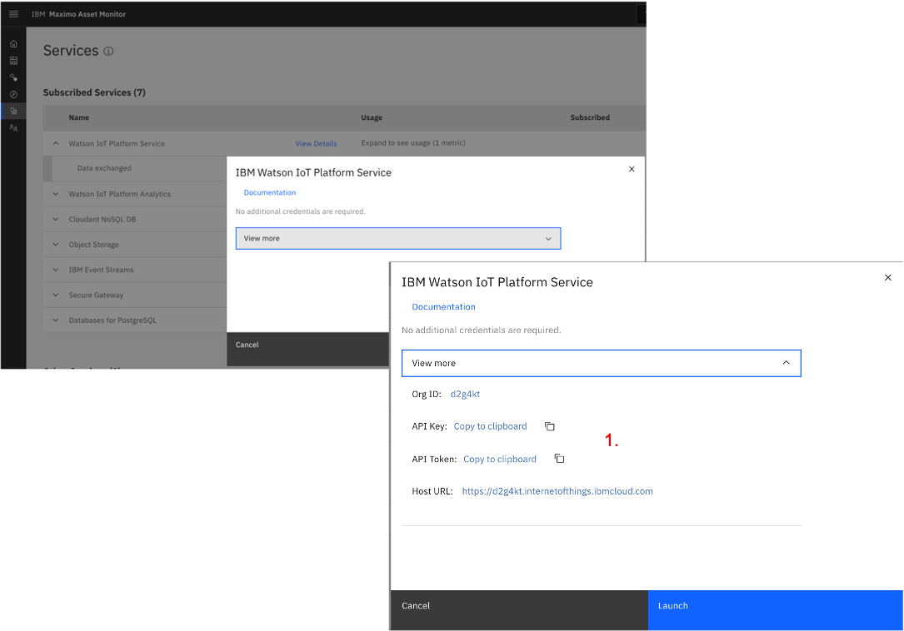
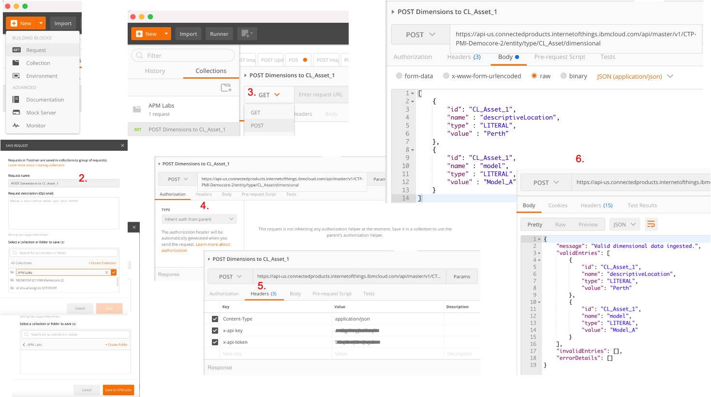
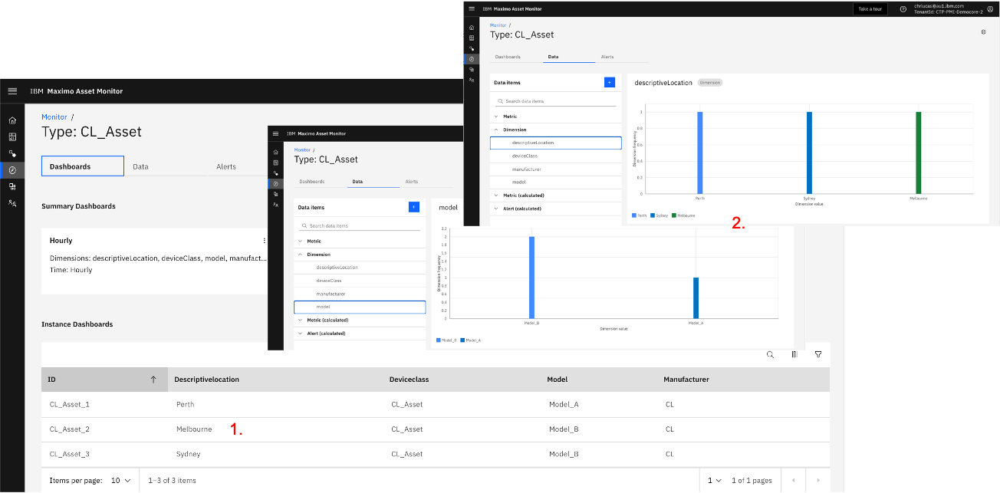
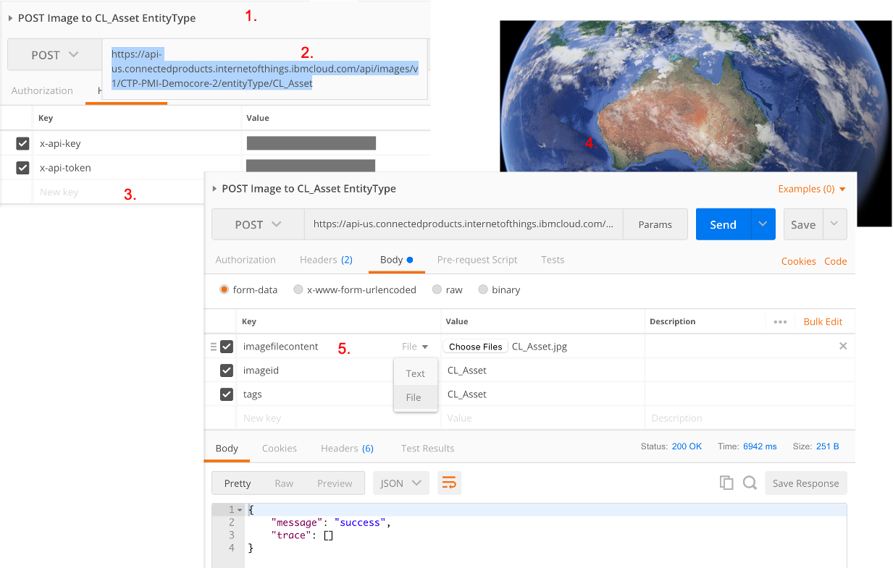
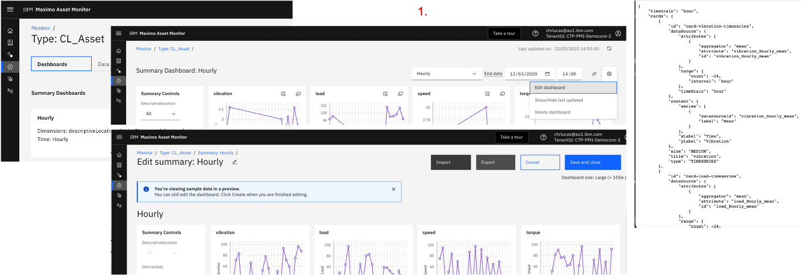
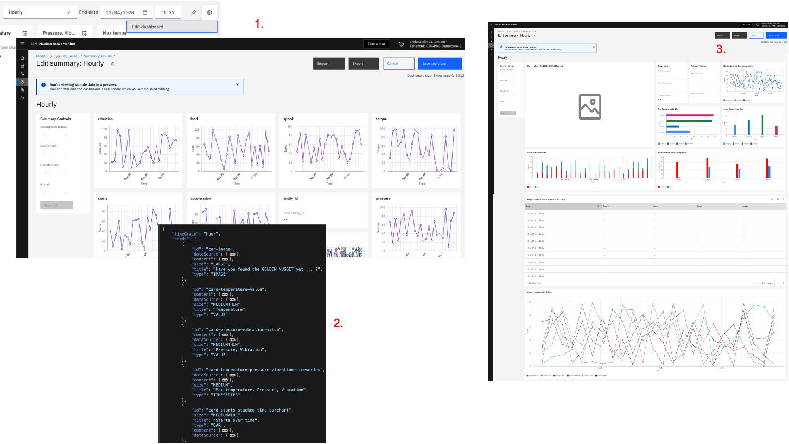

### Use Monitor API to change Dimensions and load a Picture
In the next section, we'll explain how to update and customize the initial Dashboard that we created earlier.
Prior to that, we are going to use Monitor's API to:
(a)change the `CL_Asset_1_2_3` *Metadata* values in the Watson IoT
platform so we can later see how Dashboards can be 'filtered' on those metadata values (called *Dimensions* on Monitor side),
(b) add an image and tie it to the `CL_Asset` Entity Type so we can display it on the dashboard.
We will be using [Postman](https://www.postman.com/downloads/) to do this.

1. In *Monitor*'s left menu, click the *Services* menu. On the *Watson IoT Platform Service* row, click `View Details` then `View More`.
Next to the  *API Key*, click `Copy to clipboard` - paste this into your favourite notepad for future retrieval.
Next to the  *API Token*, click `Copy to clipboard` - paste this into your favourite notepad for future retrieval. 
 &nbsp;

2. In Postman, click `Create New Request`. In *Select a collection or folder to save to*, click `Create Collection`, name it `APM Labs`.
Name your Request `POST Dimensions to CL_Asset_1`. Click `Save to APM Labs`.
3. Open the Request, and change its (default) Type from *GET* to *POST*.
4. On the *Authorization* tab, leave the default *Type* to *inherit auth from parent*. Next to the *POST* field, enter this value:
`https://api-{{geo_country_code}}.connectedproducts.internetofthings.ibmcloud.com/api/images/v1/{{tenantID}}/entityType/CL_Asset/dimensional`
where you will first need to: 
(a) replace `{{geo_country_code}}` with your specific country code 
(your country code is in the beginning of your *Monitor* Dashboard URL: `https://dashboard-{{geo_country_code}}`), i.e. to either `us`,`uk`,`de`, or `beta`
(b) replace `{{tenantID}}` with your *Monitor Tenant ID* which you can find in the top right corner of your Monitor webpage underneath your IBMiD.
An example of that string (which is the one used for these Labs) can be found below. 
5. On the *Headers* tab, in the *Key* and *Value* columns, enter the following 3 rows 
(a) *Key* = `Content-Type` and *Value* = `application/json`, (b) *Key* = `x-api-key` and *Value* = `Write the 'API Key' you fetched in step 1.`,
(c) *Key* = `x-api-token` and *Value* = `Write the 'Authentication Token' you fetched in step 1.`,
6. On the *Body* tab, click the `raw` tick-box and enter the below .json snippet. Click `Send`. 
You should get a returned result as per picture below.
7. Repeat steps 2. to 6. for (a) `CL_Asset_2` where you enter for the *descriptiveLocation*: `"value" : "Melbourne"` and for *model*: `Model_B`,
(b) `CL_Asset_2` where you enter for the *descriptiveLocation*: `"value" : "Sydney"` and for *model*: `Model_B`.

```
Example of the string to be used in Postman 'POST Dimensions to CL_Asset_1' call:

https://api-us.connectedproducts.internetofthings.ibmcloud.com/api/master/v1/CTP-PMI-Democore-2/entity/type/CL_Asset/dimensional
```

```
[
    {
        "id": "CL_Asset_1",
        "name" : "descriptiveLocation",
        "type" : "LITERAL",
        "value" : "Perth"
    },
    {
        "id": "CL_Asset_1",
        "name" : "model",
        "type" : "LITERAL",
        "value" : "Model_A"
    }
]
```
 &nbsp;

Let's now check that our changes worked ! There are several ways we can do that:

1. Go to the *Monitor* left menu. Search for and open `CL_Asset`. Watch the updated values for `descriptiveLocation` and `model` fields for the 3 Assets.
2. Go to the `Data` tab, in the `Dimensions` section, select `Model` then `descriptiveLocation` and watch !
 &nbsp;

We are now going to use another API call to upload a picture to the system.
This picture will be used in the final [10. Update your Summary Dashboard](#10-update-your-summary-dashboard).

1. Create a new `POST Image to CL_Asset EntityType` Request in Postman, make it of POST type.
2. Next to the *POST* field, enter this value:
`https://api-{{geo_country_code}}.connectedproducts.internetofthings.ibmcloud.com/api/images/v1/{{tenantID}}/entityType/CL_Asset`
after having replaced `{{geo_country_code}}` and `{{tenantID}}` with your values (see below for the sample string used for this lab).
3. On the *Authorization* tab, leave the default *Type* to *inherit auth from parent*.
On the *Headers* tab, in the *Key* and *Value* columns, enter the 2 rows `x-api-key` and `x-api-token` 
as you did previously (no need for the `Content-Type` / `application/json` row here).
4. Download this image [Image](../files/CL_Asset.jpg) and save it as `CL_Asset.jpg` on your computer.
5. On the *Body* tab, select the `form-data` tick-box. Enter enter the following 3 rows: 
(a) *Key* = `imagefilecontent`, select `File` on the right of the box. That will populate the `Value`
column with a `Choose Files` button. Click it and select your `CL_Asset.jpg`.
(b) *Key* = `imageid` and *Value* = `CL_Asset`
(c) *Key* = `tags` and *Value* = `CL_Asset`.
Click `Send`, observe the returned `"message": "success"` body.


```
Example of the string to be used in Postman 'POST Image to CL_Asset EntityType' call:

https://api-us.connectedproducts.internetofthings.ibmcloud.com/api/images/v1/CTP-PMI-Democore-2/entityType/CL_Asset
```
 &nbsp;

---
### [ARCHIVE] Update your Summary Dashboard 
*[This section was created before the new MONITOR Dashboard Visual Editing Features of 2021, when JSON edition was required.]*

In this final 'Monitor Lab' section, we are going to bring everything together and show how you can create and customise
dashboards to - literally - visualise whatever you want from all the data we generated so far.

Remember [2. Create an Hourly Summary Dashboard](#2-create-an-hourly-summary-dashboard) section ? 
We then created the simplest, out-of-the-box, Hourly dashboard.
In this section, we will (a) understand the .json file structure and *card* elements that make up dashboards,
(b) create an advanced dashboard using most of the *cards* possibilities.
Note that this will imply .json file editing and we therefore recommend a cool json editing tool that should at least 
provide the ability to collapse .json file levels for better visibility and easier navigation - we used the free
version of [BBEdit](https://www.barebones.com/products/bbedit/download.html) here.

1. Open the *CL_Asset Hourly* dashboard. Top-right, click `Edit Dashboard`, then `Export`. 
Your browser will automatically download a .json file called *Hourly-dashboard.json*. For your reference, you can also find
that original .json here: [Hourly-dashboard-ORIGINAL.json](../files/Hourly-dashboard-ORIGINAL.json).
 &nbsp;

2. Let's have a look at the main elements of that .json file. In your .json editor, `Collapse Folds below Level 2`. 
This shows the main elements of the file, i.e. : `timeGrain`, `cards`, `title`, `layouts`.
3. In your .json editor, `Collapse Folds below Level 3`. Note that you have 9 `cards` - one for each of the graphs you see on the dashboard.
Note that each card has several sub-sections, including `id` (must be unique), 
`dataSource` (this where you define what *data item(s)* you want to display on the card),
`content` (this is where you define the labels of your card),
`size`, `title` and `type` (note all cards are presently of type *TIMESERIES*, we'll soon see other types).
4. In your .json editor, `Collapse Folds below Level 4`. Let's focus on the most complex card, i.e. 
the one displaying `temperature` IoT readings for which we earlier defined `mean`, `max`, `min`, `std`, `count`, `sum` data items.
In the `dataSource` section, note (a) the `attributes` sub-sections (1 for each above data item),
(b) the `range` section where we define the default `count` and `interval` of the card,
(c) the `timeGrain`. 
In the `content` section, we define the labels of the card - note that each *attribute* defined in the *attributes* section 
MUST have a corresponding *dataSourceID* in the *content-series*.
 &nbsp;

OK, that should be enough to understand at a high-level how dashboards work.
Go through this [Dashboard JSON Reference](https://www.ibm.com/support/knowledgecenter/SSQR84_monitor/iot/dashboard/dashboard_json_ref.html)
documentation to see all that can be done with dashboards, i.e. what types of cards you can add 
(value card, table card, bar chart card, image card etc), how to change the layout etc.
This [Tutorial](https://www.ibm.com/support/knowledgecenter/SSQR84_monitor/iot/dashboard/tutorials/instance_dashboard_tutorial_adv.html) 
(which will show you how to customize a dashboard) is just 1 out of 7 tutorials which will help you master dashboarding.

As a final exercise, let's now create an advanced dashboard which will incorporate most of the card types 
(i.e. `BAR`, `TIMESERIES`, `ALERT`, `IMAGE`, `VALUE`) and dashboarding capabilities.

1. Open the *CL_Asset* `Hourly` dashboard. Top-right, click `Edit dashboard`.
2. Save this [Hourly-dashboard-CUSTOM.json](../files/Hourly-dashboard-CUSTOM.json) file to your computer.
3. Click `Import`, select the just-saved *Hourly-dashboard-CUSTOM.json*. You now have a preview of what your new
dashboard will look like. 
The json provided will work if you followed the naming conventions throughout the labs, as all *dataSourceId* (like e.g. `temperature`, 
`pressure_Hourly_mean` etc) are pretty straightforward and did not involve your initials.
Note that if you have any error while saving, check the error message which 
is usually helpful by providing you with a specific problematic *data item* name which you should then search within the .json.
Likely causes of errors you might encounter will be related to how you named data items - e.g. if you named
the picture *XY_Asset.jpg* instead of *CL_Asset.jpg*.
 &nbsp; 

This picture shows what your final dashboard should look like.
 &nbsp; 


Congratulations, you made it - hope you enjoyed this lab !