*[Page last updated on 06 May 2021]*
# [NEW] HEALTH Lab on Maximo Application Suite (8.3)
!!! DISCLAIMER
    This Lab is provided as-is and does NOT represent formal IBM documentation in any way. Please send any feedback directly 
    to [Christophe Lucas](https://www.linkedin.com/in/christophe-lucas-a5abab28/).

---
**TIP**: If the images seem too small to read, just right-click them,
open in new tab and zoom in/out.
I have tried to make all images readable with clear 1., 2., 3. etc references to the corresponding instruction steps.

---

## 0. Prerequisites & Objectives

### Prerequisites 
There are no prerequisites if you just plan to go till section [9. Update the Health Scoring Method](#9-update-the-health-scoring-method)
- you will generate all the data that you need in this Health lab which is self-contained.

But if you plan to also complete the last section [10. [OPTIONAL] Map IoT Devices & Readings to Assets & Meter Readings](#10-optional-map-iot-devices-readings-to-assets-meter-readings),
then you will need to have completed the first section of the Monitor lab:
[1. Generate IoT data](../monitor/monitor.md#1-generate-iot-data).
This is because - and that is the beauty of the fully-integrated suite - the IoT data that we created
in the first [Monitor](../monitor/monitor.md#1-generate-iot-data) Lab steps of these APM labs is the exact same data 
that is used in these last Health Lab steps - 
thus enabling true, near real-time monitoring and condition-based maintenance of your assets !

### Objectives
In this Module you will:

* set up the required Assets and Meter Groups in Manage (aka Maximo)
* create a sample Health Scoring Method, a Criticality Method and a Risk Method in Health
* populate all Cards (i.e. Health Score, Criticality, Risk, RUL, Age, Next PM, MRR) on your sample `CL_Asset_1` in Health
* [OPTIONAL] finally, associate the IoT Devices we defined in the first Monitor Lab steps of 
[1. Generate IoT data](../monitor/monitor.md#1-generate-iot-data)
to the `CL_Asset_1` and set up the required mappings between your IoT readings 
and Maximo Meter Readings.

Note that in this section, we will alternatively mention Manage or Maximo 
- both names refer to the 1 same thing.

---
## 1. Setup initial Manage data

**Important Note on Naming Conventions**: in this lab, you will create Assets which we name here `CL_Asset_1`
, `CL_Asset_2` etc (`CL` standing for Christophe Lucas). 
In a classroom setting, make sure every student replaces the `CL` by their initials throughout the lab e.g. `XY_Asset_1`,
`AB_Asset_1` etc.

---
### 1. Launch 	Manage from MAS Suite Navigator
1. Login to your MAS homepage. Click `Launch` on the Manage card.
This will open Maximo in another browser tab. Login with your Maximo ID/pwd.
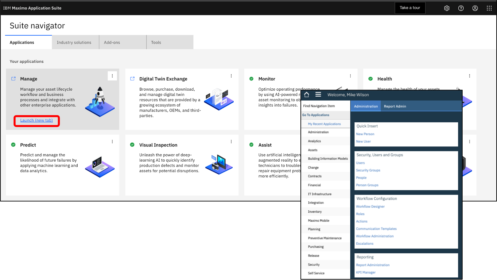&nbsp; 

---
### 2. Create 3 Assets & 1 Query

1. In Maximo, click the `Go To Applications - Asset` Menu. Click the `+` button to create an Asset, 
enter `XY_Asset_1` - where `XY` are your initials. 
Note that for the rest of this lab, we will use `CL_Asset_1` (e.g. CL for Christophe Lucas).
`CL_Asset_1` in both the Asset ID & Description fields. Click `Save`. 
Repeat this step for `CL_Asset_2` and `CL_Asset_3`.
2. Click the `List View` menu. In the Asset field, enter `CL_Asset*`, click enter.
This should return the list of your  3 just-created CL_Assets.
Click the Save Query button, enter `CL_Assets` in both the Query Name & Description. 
Tick the `Public` box.

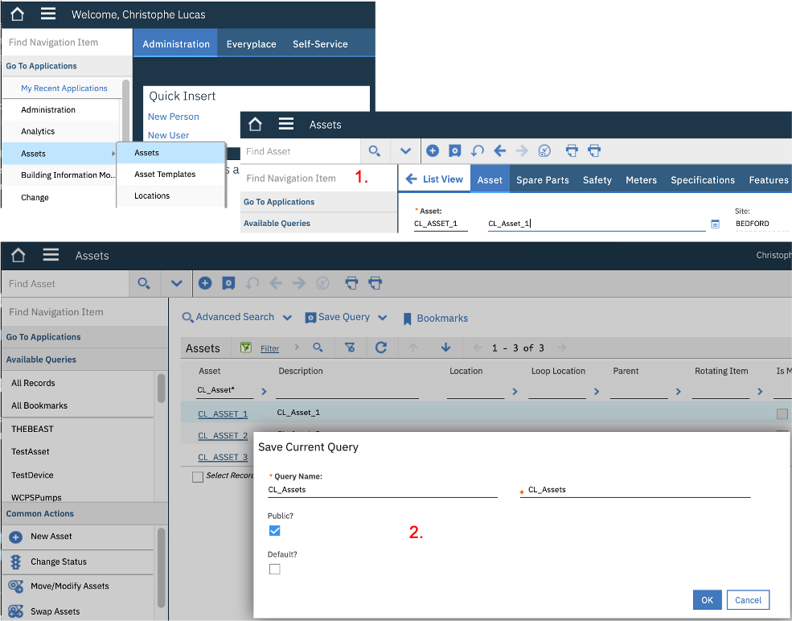&nbsp; 

---
### 3. Create a Meter Group
In this section, we will create a Maximo Meter Group containing 8 Meters that we will later associate to the 
IoT readings that we defined in the first section of the MONITOR lab.

1. In Maximo left `Find Navigation Item` box, enter the `Meter Groups` application.
2. Click the + button to create a Meter Group, enter `CL_Asset` in both the *Meter Group* & *Description* fields.
3. Click `New Row` and in the *Meter* field, click `Select Value`. 
In the *Select Value* window that opens, enter `Temp` in the Meter field, hit Enter, select `TEMP-C`.
4. Repeat previous step with the following *Meters*: 
`VIBRATIONH`, `PRESSURE`, `SPEED`, `ACCELERAT`, `LOAD`, `TORQUE`, `STARTS`. Click the `Save` button.

Note that, although Meters like `PRESSURE` often exist in Maximo installations out-of-the-box, 
some of the Meters appearing in step 4. might not exist in Maximo yet. In which case, do the following:
(a) Go to the `Meters` menu via `Find Navigation Item`, (b) click `Create` new Meter, enter e.g. `ACCELERAT` (the maximum name length is 9 ),
select `GAUGE` as `Meter Type`, then `Save`. That newly created *Meter* can now be added to the *Meter Group* in step 4.

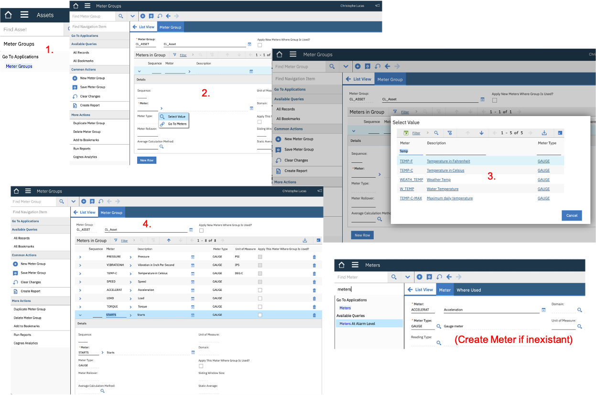&nbsp; 

---

### 4. Associate Meter Group to Assets & create Meter Readings
1. In Maximo, click the `Go To Applications - Asset` Menu. In the Asset field, enter `CL_Asset*`, click enter.
This will return the list of you 3 *CL_Assets*, click `CL_Asset_1`.
2. Go to On *CL_Asset_1*, go to its *Meters* tab, click `Meter Group - Select Value`. In the *Select Value* window,
`CL_Asset*`, click enter, select the `CL_Asset` Meter Group. Click `Save`.
This has loaded all the *Meters* we defined in the *Meter Group*.
3. In left *Find Navigation item* box, enter `Enter M`, click `Enter Meter Readings`. For each Meter, enter values within the ranges 
that we defined for the IoT readings at the beginning of the Monitor lab in [2. Create IoT Simulation](../monitor/monitor.md#2-create-iot-simulation).
For example: `TEMP-C` = `37`, `VIBRATIONH` = `4`, `PRESSURE` = `22`, `SPEED` = `17`, 
`ACCELERAT` = `9`, `LOAD` = `100`, `TORQUE` = `12`, `STARTS` = `1`. Click `OK`.
4. Repeat steps 1. to 3. for `CL_Asset_2` and `CL_Asset_3` with whatever Meter values you want.

&nbsp;

---

### 5. Create a Condition Monitoring Rule
We are now going to define a Condition Monitoring rule where 
we will create upper and lower limits for the Meter Readings corresponding to `TEMP-C`, for Asset `CL_Asset_1`.

1. In Maximo, click the `Go To Applications - Condition Monitoring` Menu. 
Click the `+` to create a new Condition Monitoring. Name it `CL_Asset`. 
In the *Point* and *Description* fields, enter `CL_Asset*`.
Next to the *Asset* field, click `Select Value`, search for `CL_Asset_1`, select it.
Next to the *Meter* field, click `Select Value`, search for `TEMP-C`, select it.

2. In the *Upper Warning Limit* field, enter `40`, in the *Lower Warning Limit* field, enter `35`.
In the *Upper Action Limit* field, enter `45`, in the *Lower Action Limit* field, enter `30`.
Note that those values roughly correspond to the `"temperature": random(35,40),` values we originally defined in our IoT Simulation.
With those limits defined, Condition Monitoring should pick-up those anomalous `"temperature": random(46,48),` we generated !

3. In the *Upper Limit Job Pan* field, click `Select Value` and select whatever existing *Job Plan* you want (we're just
doing a demo here !). Do the same for *Upper Limit Job Pan*. Click `Save`. Your final screen should look like picture below.
&nbsp;

---

## 2. Setup Health

---

### 1. View your Assets in Health
1. From the MAS homepage, Click `Launch` on the Health card. 
2. Go to the top-left Assets menu. Enter `CL` in the Search bar. 
This will return the 3 Assets we just created in Maximo.
3. Click on `CL_Asset_1`, and observe the various cards that
appear out-of-the-box - they are all empty for the moment. Let's populate them !

**NOTE**: it is normal that you see Predict in the top middle menu, 
even though you accessed this screen via the Health card.
As you can see, Health & Predict actually appear on the 
same UI (i.e. Predict corresponding to the Predictions section just below the 
Health details section). 
When a user is entitled to both Predict & Health,
Predict is always displayed. With a user only entitled to Health and NOT Predict, the top-middle menu
would display Health.

&nbsp;

---

### 2. Create Factors in Health associated to Meters in Manage
Before we create our Scoring Methods, let's first check that the Meters we
associated to the 3 CL_Assets in [4. Associate Meter Group to Assets & create Meter Readings](#4-associate-meter-group-to-assets-create-meter-readings)
exist (or not) as Factors in Health already - if they already exist, good,
if not, we'll just create them.

1. Go to the top-left Scoring menu, then go to the Factors tab.
Check which ones of the Meters you earlier defined already exist as Factors in Health, e.g. typically you will see that `VIBRATIONH`, `TEMP-C` are already defined, but NOT e.g. `Speed`.
Let's add `Speed` as a Factor. On the Factors tab, click `Creat Factor`.
2. Name your Factor `Speed`, select `Meter` in the `Calculate a score from` box. Then select `Speed` in the pop-up box.
In the Score Normalization's Upper & Lower Limits, enter `20` & `15` (corresponding to the upper & lower limits we
originally defined in [1. Create IoT Simulation](../monitor/monitor.md#2-create-iot-simulation)).

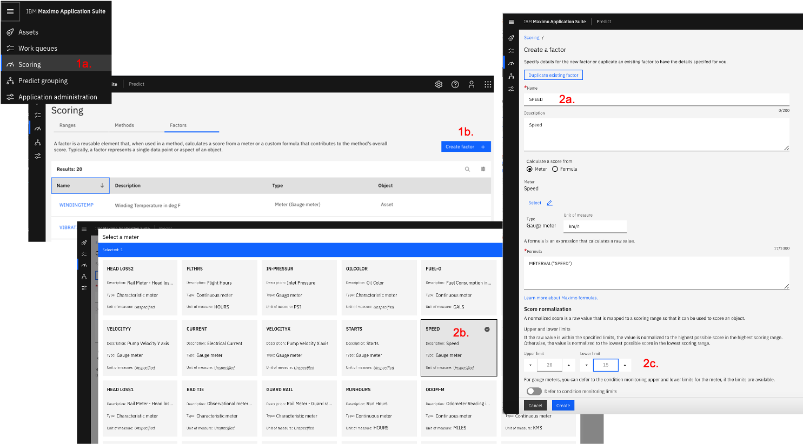&nbsp;

---

### 3. Create a simple Health Scoring Method and associated Drivers

Let's first create the Health Method itself:

1. Via the Scoring menu, go to the  `Methods` tab and click `Create method`.
Name your method `CL_Asset_Health`, and select `Health` in the Type drop-box.
2. Under the `Scored Assets` field, click `Select` and select the `CL_Assets` query we defined in 
[2. Create 3 Assets & 1 Query](#2-create-3-assets-1-query) section.

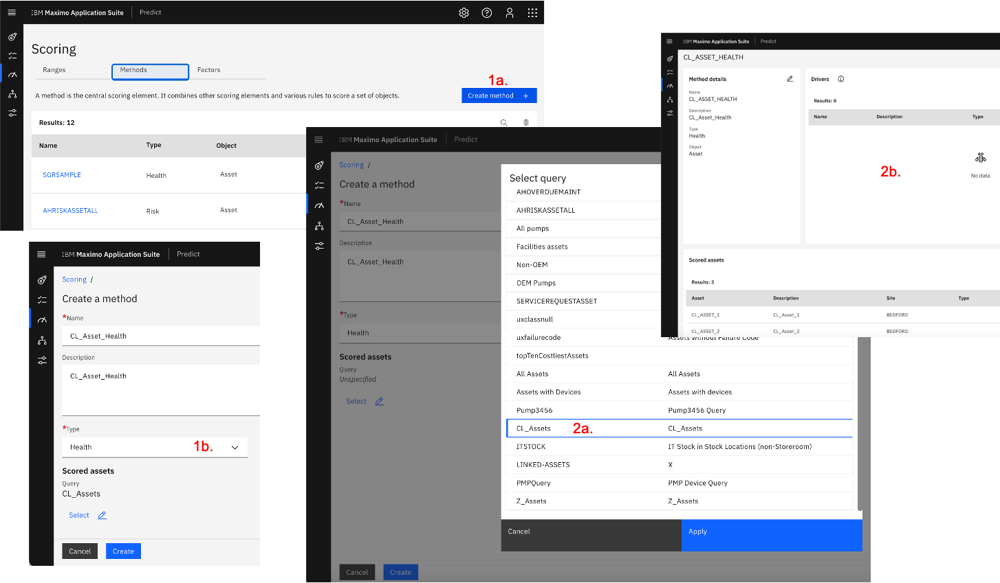&nbsp;

Let's now add Drivers to this Method:

1. Staying on the `CL_Asset_Health` Method, click the `+` top-right icon to create a Driver.
Name it `Meter Readings`, select `One or more factors` in the `Calculate a score from` tick-box.
Click `Create`.
2. The `Meter Readings` Driver now appears in the Drivers list, but is still empty.
Let's add all the Factors (associated to Meter Readings) we just created to this Driver.
Click the `+` top-right icon to select those Factors.
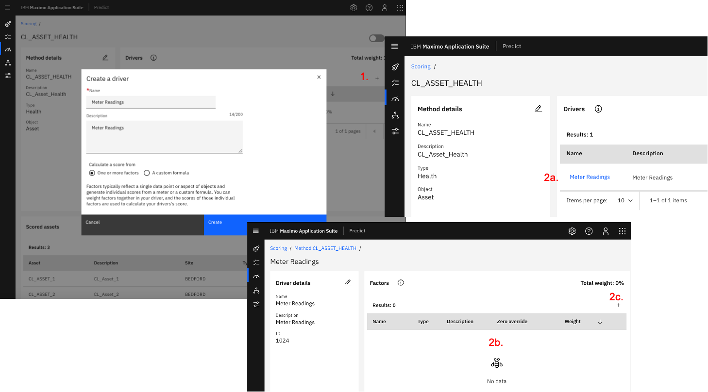&nbsp;
3. In the opened `Select factors` window, select the 8 Factors relevant to our CL_Assets and click `Add to driver`.
The 8 Factors are now added to the Meter Readings Driver.
4. Click the top-right pencil to give a Weight to the 8 Factors.
Note the total of the 8 Weights must be 100%. Enter `10%` for all Factors, 
except for `TEMP-C` for which enter `30%`.
&nbsp;

---

### 4. Check your Health Score card and make it change

We are now going to first check that the Health Scoring Method we just defined results in 
a Health score being calculated for our CL_Assets, based on the Meter Readings we entered
in earlier [section](#4-associate-meter-group-to-assets-create-meter-readings). 
Then, we will enter new Meter Readings for CL_Asset_1 and notice that its Health Score automatically changes.

1. Go to the top-left Assets menu. Enter CL in the Search bar. This will return the 3 `CL_Assets`. 
Select `CL_Asset_1`. 
Notice how the `Health` card displays a score of 70%.
Going into the `Health details` card, notice how you can see the values of all the Meter Readings we entered,
and how, based on the Factors and Method we defined, each Meter either shows red or green.
Note that you can also see all Meter Readings in the `Operational status` section.
&nbsp;
2. From Health, access Manage by clicking on the top-left 
`IBM Maximo Application Suite` banner, then by clicking the Manage card.
3. Go to Maximo's Asset menu, enter `CL*` in the Asset field and click enter.
This will display the 3 `CL_Assets`, select your `CL_Asset_1`.
In the `Find Navigation Item` menu, write `Enter Meter Readings`, click Enter and just enter 
a value of `55` for `TEMP-C`. This means that `TEMP-C` is going to move above the 
normal operating conditions we originally defined in the 
[IoT Simulation](../monitor/monitor/#2-create-iot-simulation)
(i.e. between 35 & 40 Celsius).
4. Go back to Health. Select your `CL_Asset_1` row. Top-rigt, click `Recalculate Health score`.
Observe how your Health card gets updated from `70%` (orange) to `40%` (red).
&nbsp;

---

### 5. Create Criticality & Risk Scoring Methods and populate Criticality & Risk cards

We now are going to create another type of Method, i.e. a Method of type `Criticality`
which will feed the `Criticality` card on a given Asset.

1. From the top-left `Scoring` menu,go to the `Method` tab and click `Create method`.
Name it `CL_Asset_Criticality`. In the `Type`, select `Criticality`.
In the `Scored Assets`, select the `CL_Assets` query as we did in [section 3.](#3-create-a-simple-health-scoring-method-and-associated-drivers)
Click `Create`.
2. Click on the just created `CL_Asset_Criticality` link. Click the to-right Edit pencil.
In the `Formula` field, just write `Priority`.
**NOTE:** in  this case, we are simply defining the Health Criticality score of a given Asset
as the value of the Asset's `Priority` field - which we will populate in Maximo in next steps.
We will see in next sections how more advanced formulas can be defined, where pretty much any other
field associated to the given Asset in Maximo can be used.
3. As a final step for this Criticality card, make sure you tick the `Active` checkbox to activate
our `CL_Asset_Criticality` method.

&nbsp;

Let's now create a Risk Method and populate the Risk card.

**NOTE**: Because the definition of Risk might vary from an organisation to another, this Risk Method is fully configurable. 
You can use these [Formulas references](https://community.ibm.com/community/user/iot/viewdocument/maximo-formula-documentation?CommunityKey=ed77c224-45e2-47b0-b574-cc31496f9a41&tab=librarydocuments&LibraryFolderKey=7b6b215d-3d7b-4c21-a720-e8c2c62b7f07&DefaultView=folder)
to have an idea of what custom formulas you can construct. 
By default, the Risk Score in MAS-Health is defined as follows:
*By default, risk is calculated by dividing 
the remainder of the health score by 100 and then multiplying the resulting number by the criticality score.*

1. From the top-left `Scoring` menu, go to the `Method` tab and click `Create method`.
Name it `CL_Asset_Risk`. In the `Type`, select `Risk`.
In the `Scored Assets`, select the `CL_Assets` query as we did in [section 3.](#3-create-a-simple-health-scoring-method-and-associated-drivers)
Click `Create`.
2. Click on the just created `CL_Asset_Risk` link. Click the top-right Edit pencil.
In the `Formula` field, write `IF((ISNULLF(ASSETLOCSCORE("health")) || ISNULLF(ASSETLOCSCORE("criticality"))), NULLVALUE(),((100-ASSETLOCSCORE("health"))/100)*ASSETLOCSCORE("criticality"))`.
That is the code translation of what we just wrote in earlier Note.
Make sure you tick the `Active` checkbox to activate our `CL_Asset_Risk` method.
3. Go back to `CL_Asset_1`, open it and top-right, click `Edit source aset record`, that will open the asset in Maximo.
There, simply enter `3` in the `Priority` field, click `Save`, go back to Health.
4. Wait a minute (for some Manage-Health background process to complete),
go back to your `CL_Asset_1`, click top-rigt `Recalculate Health score` and observe how both your `Criticality`
and `Risk` cards now display data !

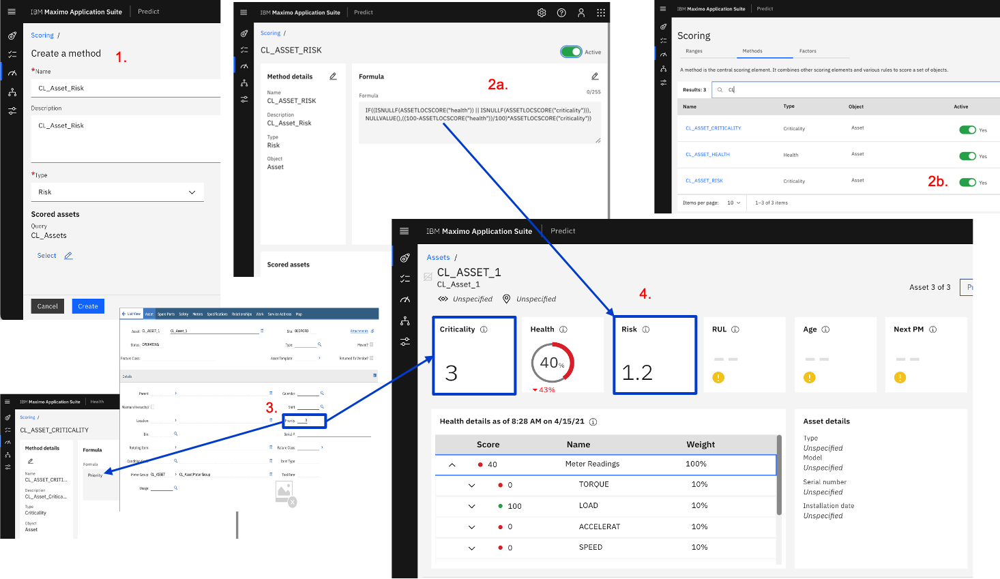&nbsp;

---

### 6. Populate the RUL & Age cards
The `Age` card displays *the current system date minus the installation date* of an asset.

The `RUL` card is calculated as follows: *The remaining percentage of the asset's useful life. The remaining useful life (RUL) is calculated by subtracting the age from the manufacturer’s expected life. If the age exceeds the expected life, the RUL is 0%.*.

So back to `CL_Asset_1` in Maximo, simply set a value in `Installation Date` (set it e.g. > 5 years in the past),
and a value in `Expected Life` (make it > 15 years). Go back to `CL_Asset_1` in Health, click top-right `Recalculate health score`
button, and ... there you go: the `Age` and `RUL` cards are now populated !

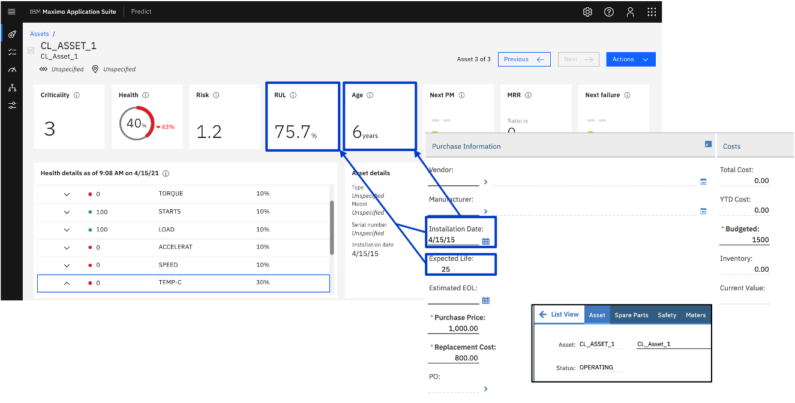&nbsp;

---

### 7. Populate the Next PM & MRR cards and the Asset Timeline

The `Next PM` card displays *the time until the next scheduled preventive maintenance (PM) event.*
To populate it, we must therefore associate a preventive maintenance to our asset. To do that:

1. Go back your `CL_Asset_1` in Maximo. In the top-left `Find Navigation Item` menu, 
write `Preventive Maintenance` and click enter. That will take you to the `Preventive Maintenance` menu.
2. Click the `+` top button to create a new `Preventive Maintenance`.
Leave the PM ID as-is, and write `CL_Asset_1_PM` in the PM Description field. In the `Asset` field, select your `CL_Asset_1`.
3. Go to the `Frequency` tab. In the section `Time Based Frequency`, enter `3` in `Frequency`, and in
the `Estimated Next Due Date`, enter a date e.g. `55` days in the future.
4. In `Find Navigation Item` menu, write `Change Status`, click enter, and set the Status to `Active`, click OK.
5. Wait a minute, then go back to `CL_Asset_1` in Health. Click `Recalculate health score` in top-right `Actions`
menu ... and you should now see a `Next PM` value !

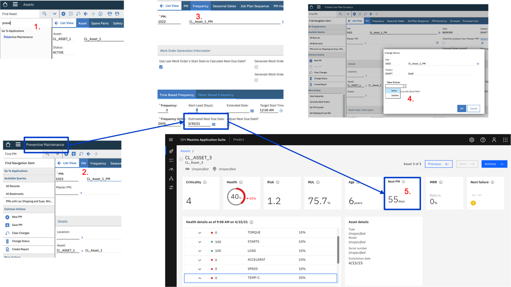&nbsp;

The `MRR` card displays: *The maintenance-to-replacement ratio (MRR) for the asset. The MRR is calculated by dividing the current total cost of all maintenance for the asset, including parts and labor, by the replacement cost.*

To populate it, we must therefore create work that has costs associated !

1. In Maximo, open `CL_Asset_1`. In the left menu, click `Create - Work Order`, name it `CL_Asset_1_WO_1`.
2. Go to the `Work` tab, you will see the just created `CL_Asset_1_WO_1`. Click `Go To Work Order Tracking`.
3. On the opened work order, from left menu, click `Change Status` and set the status of the work order to `Approved`.

&nbsp;

1. Go to the `Actuals` tab and at the bottom of that tab, click the `Select Labor` button. (**NOTE**: Here we expect that your Maximo instance has a least 1 existing Labor already). Select e.g. `BALL`. Extend the `BALL` row.
2. In the `Details` section, enter a `Start Date` in the past, and enter e.g. `10` in the `Regular Hours`
field. Note the `Rate` value (i.e. `22` in this case) and how the `Line Cost` = `Hours x Rate` (e.g. 220 = 22 x 10 in our case).
3. Click `Change Status` and set the status of the work order to `Complete`.
4. In the left menu `Find Navigation Item`, type then launch `Run Reports`.
In the `Reports and Schedules` window that opens, navigate to the `Maintenanc Cost Rollup Update`. Click `Create Report`.
On the `Request Page`, select a `Site` (e.g. =BEDFORD) and set the `Schedule` to `Immediate`. Click `Submit`.

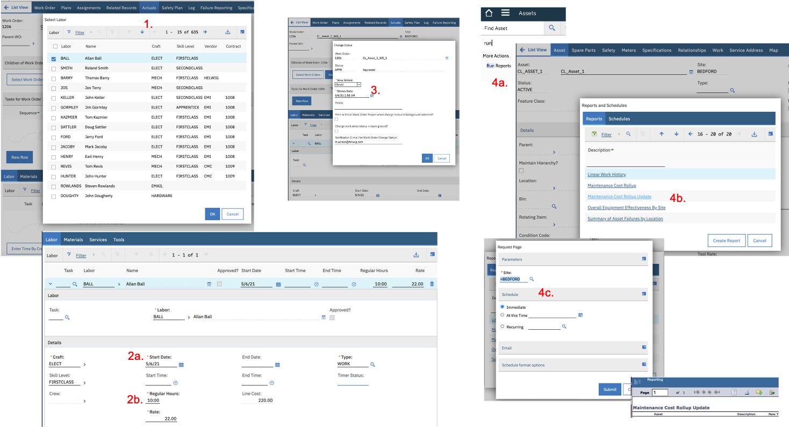&nbsp;

Finally, we can see our last card populated !
In this case, the MRR now equals `27.5%` - which indeed is the result of this calculation:
`Total Cost / Replacement Cost = 220/800 = 27.5%`.

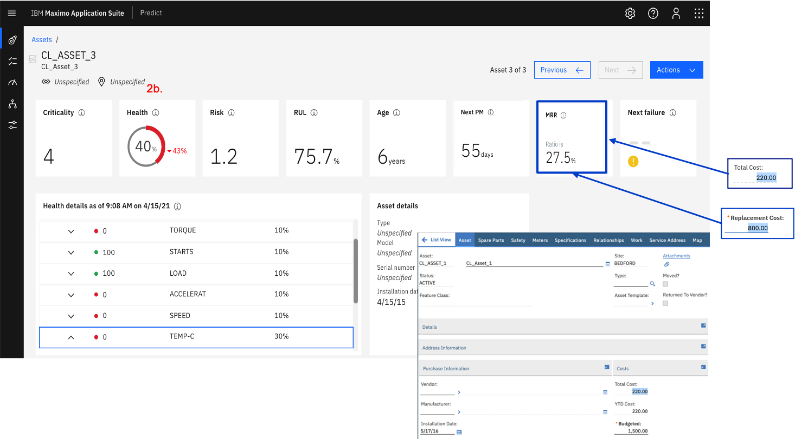&nbsp;

---

### 9. Update the Health Scoring Method

As a last exercise, we are going to update the Health Scoring Method we [earlier defined](#3-create-a-simple-health-scoring-method-and-associated-drivers).
This will give you a glimpse at how configurable health scores are.

1. In Health, go back to the left `Scoring` menu. Open the `CL_Asset_Health` Method and `Deactivate` it (top-right).
Click the `+` top-right icon to add a new `Driver`.
Enter `Year to Date vs. Replacement Cost` in the Name and tick the `A custom formula` tickbox.
In the formula field, enter `IF(ytdcost>(replacecost/50),20,20-PCT(ytdcost,replacecost))`.
This is another calculation involving the `Year to Date Cost` and `Replacement Cost` associated to `CL_Asset_1`.
In the `Best Score` enter `100`, and in `Worst Score` enter `0`. Click `Create`.
2. Similarly to what we just did, create another `Driver`, call it `Open Work Orders`.
In the `Custom formula` field, enter `count$openwo`.
In the `Best Score` enter `0`, and in `Worst Score` enter `5`. Click `Create`.
3. On the Drivers list, click the top-right pencil, and give weights to the 3 Drivers, 
e.g. `Meter Readings` at `60%`, `Year to Date vs. Replacement Cost` and `Open Work Orders` at `20%`.
4. This is what your `CL_Asset_Health` Drivers list should look like.

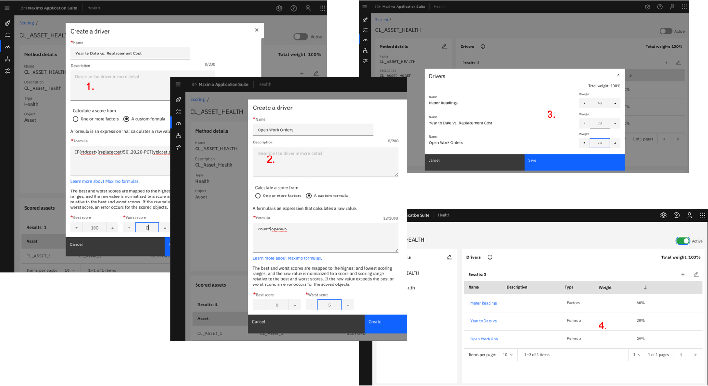&nbsp;

Finally, come back to your `CL_Asset_1`, click `Recalculate Score` and ... 
contemplate your work - well done and congratulations !

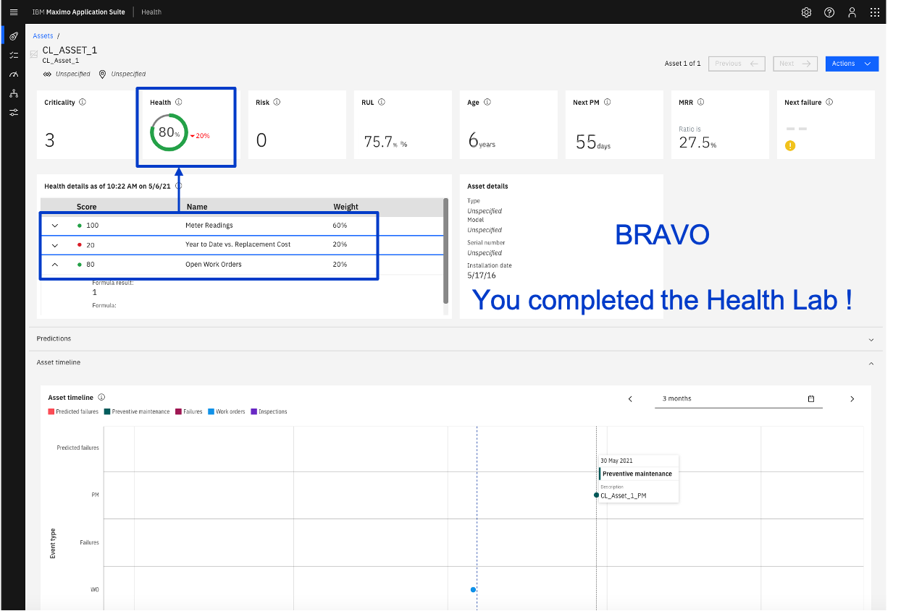&nbsp;

---

---

### 10. [OPTIONAL] Map IoT Devices & Readings to Assets & Meter Readings

In this last optional section, we will map the IoT Devices & Readings we defined
in the first steps of the [Monitor](../monitor/monitor.md#1-generate-iot-data) Lab 
to the Assets & Meter Readings we defined in the earlier [1. Setup initial Manage data](#1-setup-initial-manage-data) step of this Health Lab.
This will enable the automated synching of the IoT Readings to Manage Meter Readings - in this case,
we will take an hourly average of the IoT readings and transform them into 1 new Meter Reading every hour.
That is what will ultimately make real condition-based maintenance a true possibility !

Go to your Manage - Health integration page (typically set at: `http://MANAGE-URL/maximo-x/#/administrator/integration`),
and to the `IoT Connector` tab.

1. On the `IoT Connection Service` tab, tick the `IBM Maximo Asset Monitor` tick-box. Click `Next` 3 times.
**NOTE:** For these labs, we assume that the `Configure IoT Service` and `Configure End Points` were already set by your instructor. 
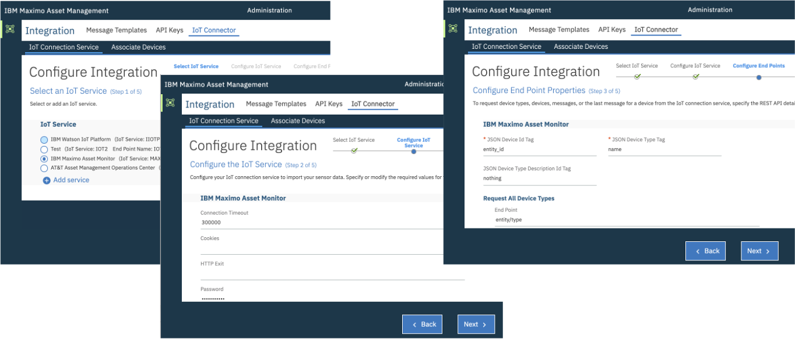&nbsp;
2. On the `Register Device Types` tab, select `CL_Asset_LI` (which corresponds to the Logical Interface you defined in
[4. Create Physical & Logical Interfaces](../monitor/monitor.md#4-create-physical-logical-interfaces)).
Click the `Register as asset` button.
3. That will move you to the `Map Data Schema` page. On the `CL_Asset_LI` row, click the right Edit pencil.
On the opened `Schema` tab, click `Detect from a connected device` and `From first available`.
Click `Get Now`.
Assuming data is flowing to your `CL_Asset_1` device, that should populate the box below the button
with a json corresponding to your IoT readings. Click `Save changes`.

4. On the `Device Type mappings` tab, click `Add Mapping` button.

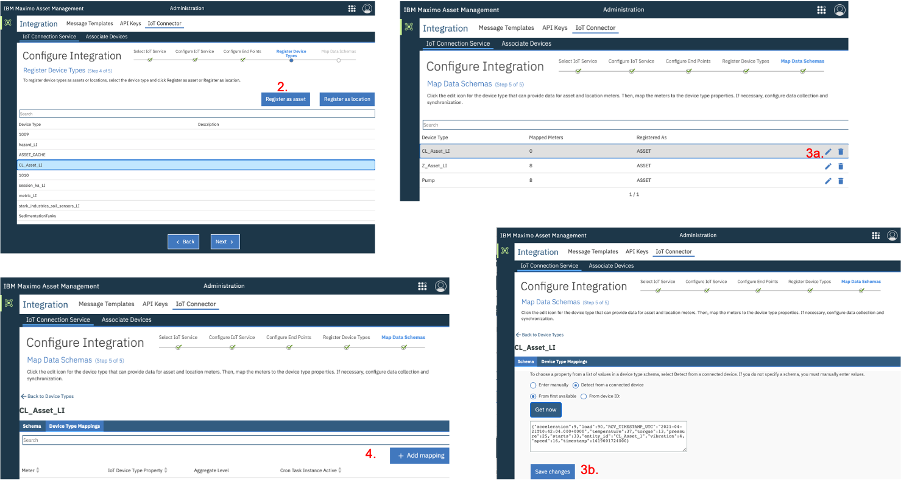&nbsp;

Let's now do the associations between the IoT Device Readings and Manage Meter Readings.

1. Click `Select meter` and select `TEMP-C`. In the `IoT Device Type Property`, select `temperature`.
In the `Data collection` section, tick the `Agregated` then 
`Detect from a connected device` and `From first available` tick boxes.
Click `Get now` then `Save changes`. Select `avg` (i.e. average) in the `Value` field,
and `HOUR` in the `Time Period` field.
In the `Dat Synchronization` section, make sure you tick `Cron Task Instance Active`.
2. Repeat step 1. for the 7 other readings. Select `avg` for all, except for `STARTS` for which select `count`.
3. Your final `Device Type mappings` tab should look like this.

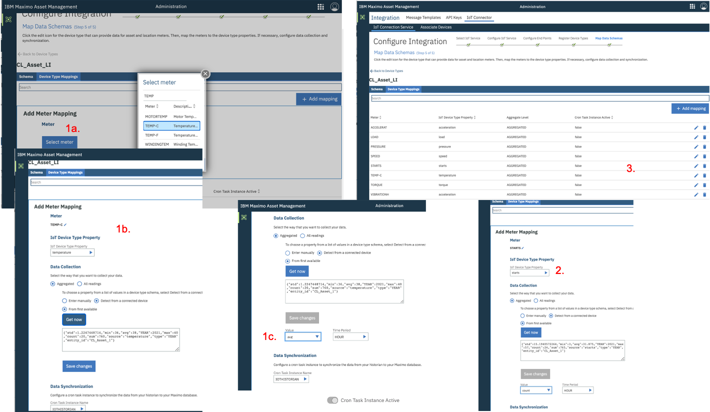&nbsp;

Finally let's associate the IoT Devices and Manage Assets.

1. On the `Associate Devices` tab, click the `Associate Assets` sub tab. 
Type `CL_` in the Search field. On the first row  where `CL_Asset` = `CL_Asset_1` and `Meter = `PRESSURE`, 
select `CL_Asset_1_LI` in the `Device Type` column, and `CL_Asset_1` in the `Device ID` column.
2. Repeat step 1. for the other 7 Readings. Do not forget to click the `Save` icon. That wil move
you to the `Manage Assets` tab which should look like this.
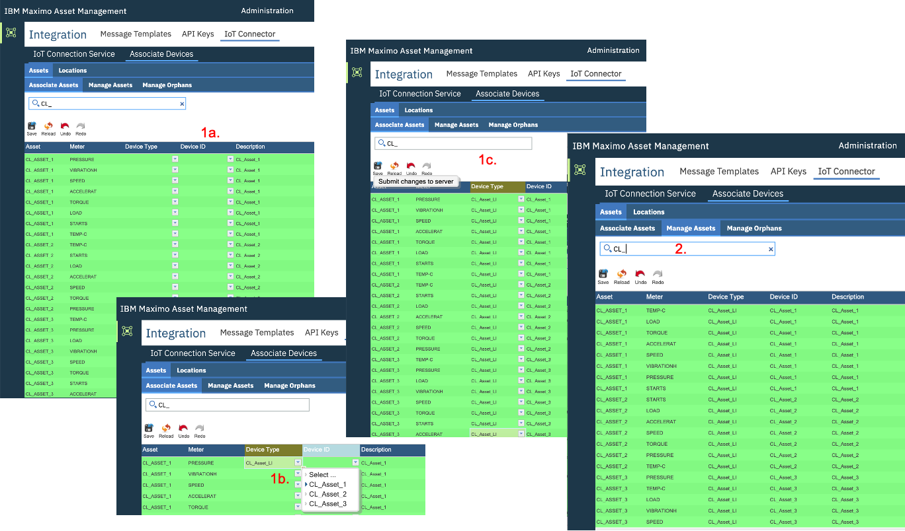&nbsp;

Thats' it ! To check that the associations worked well, just wait a couple hours, then
back in Health, open `CL_Asset_1`, go to the `Operational Status` tab, click `TEMP-C` and observe that every hour, 
a Meter Reading entry has been automatically created taking the average of the past hour IoT readings.

Well done again - you are now ready to consider a move to a real Condition-based maintenance regime for your (critical) assets.

&nbsp;