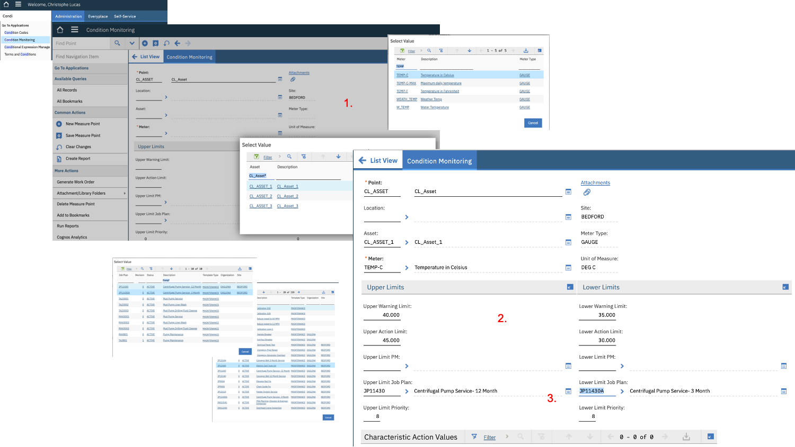
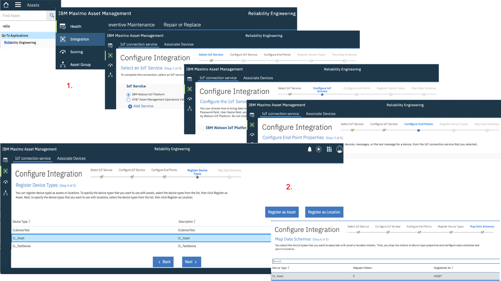
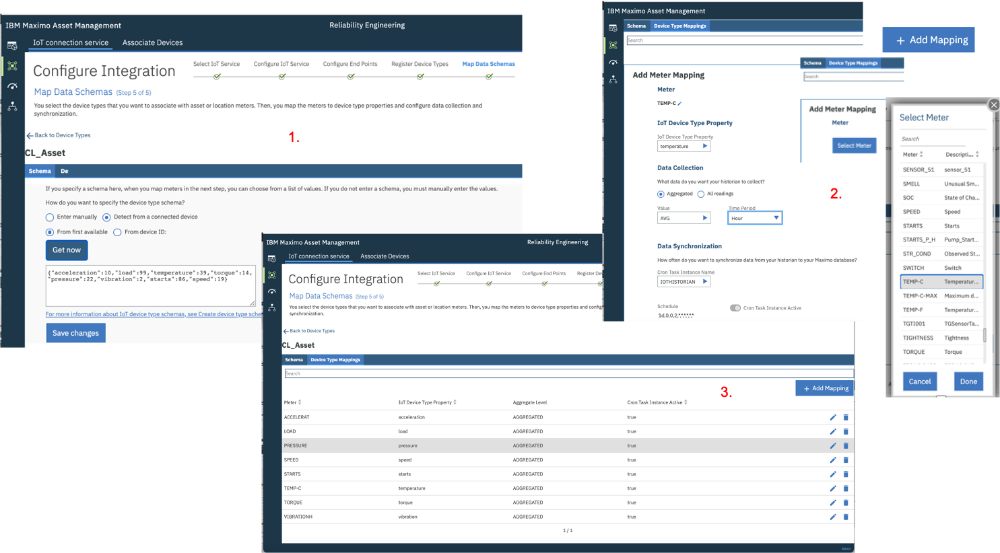
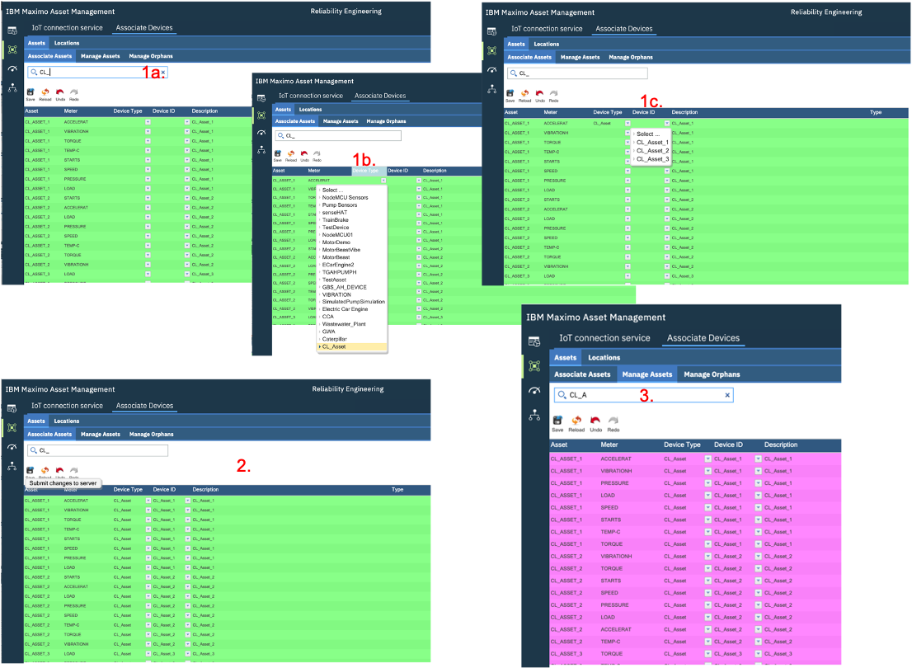
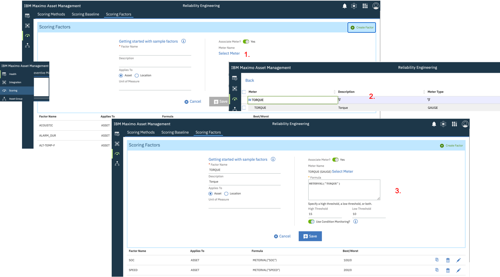
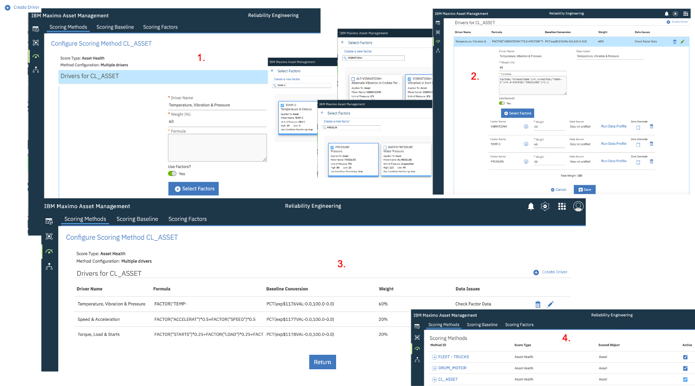
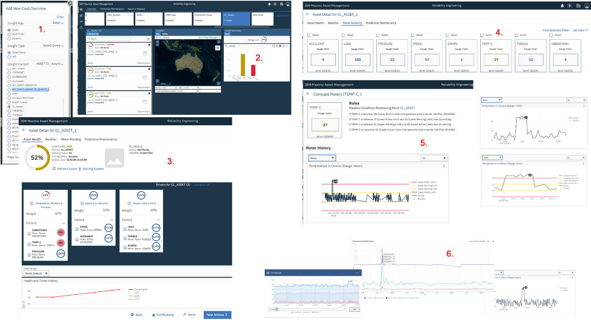

*[Page last updated on 18 February 2021]*
# HEALTH Lab on Maximo Asset Health Insights 7.6.1
!!! DISCLAIMER
    This Lab is provided as-is and does NOT represent formal IBM documentation in any way. Please send any feedback directly 
    to [Christophe Lucas](https://www.linkedin.com/in/christophe-lucas-a5abab28/).

---
*Before you begin:*  You must have completed the [1. Generate IoT data](../monitor/monitor.md#1-generate-iot-data)
section of the MONITOR lab before starting this HEALTH lab.
Note that it is not required to have completed the second [2. Monitor IoT data](../monitor/monitor.md##2-monitor-iot-data) section to go on here.

---

## 0. Objectives

In this Module you will:

* set up the required *Assets* and *Meter Groups* in Maximo,
* register your IoT *Devices* and associate them to Maximo *Assets* and set up the required mappings between your *IoT readings* 
and Maximo Assets *Meter* readings.
* create a sample *Scoring Method* to view the health of your Assets
* create a final dashboard and retrospect on the data that we have been using since the start.

---
## 1. Setup Assets, Meters & Condition Monitoring in Maximo

---
### 1. Create 3 Assets & 1 Query in Maximo
1. In Maximo, click the `Go To Applications - Asset` Menu. Click the `+` button to create an Asset, 
enter `CL_Asset_1` in both the *Asset ID* & *Description* fields. Click `Save`. 
Repeat this step for `CL_Asset_2` and `CL_Asset_3`.
2. Click the `List View` menu. In the Asset field, enter `CL_Asset*`, click enter. 
This should return the list of your 3 just-created *CL_Assets*. 
Click the `Save Query` button, enter `CL_Assets` in both the *Query Name* & *Description*. Tick the `Public` box.
&nbsp; 

---
### 2. Create a Meter Group
In this section, we will create a maximo *Meter Group* containing 8 *Meters* that we will later associate to the 
*IoT readings* that we defined in the first section of the MONITOR lab.

1. In Maximo to-left `Find Navigation Item` box, enter the `Meter Groups` application.
2. Click the + button to create a Meter Group, enter `CL_Asset` in both the *Meter Group* & *Description* fields.
3. Click `New Row` and in the *Meter* field, click `Select Value`. 
In the *Select Value* window that opens, enter `Temp` in the Meter field, hit Enter, select `TEMP-C`.
4. Repeat previous step with the following *Meters*: 
`VIBRATIONH`, `PRESSURE`, `SPEED`, `ACCELERAT`, `LOAD`, `TORQUE`, `STARTS`. Click the `Save` button.

Note that, although Meters like `PRESSURE` often exist in Maximo installations out-of-the-box, 
some of the Meters appearing in step 4. might not exist in Maximo yet. In which case, do the following:
(a) Go to the `Meters` menu via `Find Navigation Item`, (b) click `Create` new Meter, enter e.g. `ACCELERAT` (the maximum name length is 9 ),
select `GAUGE` as `Meter Type`, then `Save`. That newly created *Meter* can now be added to the *Meter Group* in step 4.
&nbsp; 

---
### 3. Associate Meter Group to Assets & create Meter Readings
1. In Maximo, click the `Go To Applications - Asset` Menu. In the Asset field, enter `CL_Asset*`, click enter.
This will return the list of you 3 *CL_Assets*, click `CL_Asset_1`.
2. Go to On *CL_Asset_1*, go to its *Meters* tab, click `Meter Group - Select Value`. In the *Select Value* window,
`CL_Asset*`, click enter, select the `CL_Asset` Meter Group. Click `Save`.
This has loaded all the *Meters* we defined in the *Meter Group*.
3. In left *Find Navigation item* box, enter `Enter M`, click `Enter Meter Readings`. For each Meter, enter values within the ranges 
that we defined for the IoT readings at the beginning of the Monitor lab in [2. Create IoT Simulation](../monitor/monitor.md#2-create-iot-simulation).
For example: `TEMP-C` = `37`, `VIBRATIONH` = `4`, `PRESSURE` = `22`, `SPEED` = `17`, 
`ACCELERAT` = `9`, `LOAD` = `100`, `TORQUE` = `12`, `STARTS` = `1`. Click `OK`.
4. Repeat steps 1. to 3. for `CL_Asset_2` and `CL_Asset_3` with whatever Meter values you want.
&nbsp;

---
### 4. Create a Condition Monitoring Rule
We are now going to create a *Condition Monitoring* rule.
The ultimate idea here is that we will create upper and lower limits for the Meter Readings which, when passed, can automatically trigger work orders.
Because we will later tie our original IoT readings from the *Watson IoT Platform* to Meter readings in *Maximo*,
this will literally allow us to move towards a real *Condition Based* maintenance regime !

In this exercise, we will create such a rule for just 1 Asset (*CL_Asset_1*) and 1 reading (*TEMP-C*), but you can
of course create more rules for other Assets and/or other readings.

1. In Maximo, click the `Go To Applications - Condition Monitoring` Menu. 
Click the `+` to create a new Condition Monitoring. Name it `CL_Asset`. 
In the *Point* and *Description* fields, enter `CL_Asset*`.
Next to the *Asset* field, click `Select Value`, search for `CL_Asset_1`, select it.
Next to the *Meter* field, click `Select Value`, search for `TEMP-C`, select it.

2. In the *Upper Warning Limit* field, enter `40`, in the *Lower Warning Limit* field, enter `35`.
In the *Upper Action Limit* field, enter `45`, in the *Lower Action Limit* field, enter `30`.
Note that those values roughly correspond to the `"temperature": random(35,40),` values we originally defined in our IoT Simulation.
With those limits defined, Condition Monitoring should pick-up those anomalous `"temperature": random(46,48),` we generated !

3. In the *Upper Limit Job Pan* field, click `Select Value` and select whatever existing *Job Plan* you want (we're just
doing a demo here !). Do the same for *Upper Limit Job Pan*. Click `Save`. Your final screen should look like picture below.
&nbsp;

---
## 2. Map IoT Devices & Readings to Maximo Assets & Meters

---
### 1. Register IoT Device Type as an Asset
*[As earlier mentioned, this step assumes that the integration between the Watson IoT Platform and Maximo Reliability
Engineer work centre exists. If not, here are the [Integration Setup Instructions](https://www.ibm.com/support/knowledgecenter/SSYKK9_7.6.1/com.ibm.ah.doc/integrate/t_ctr_int_iot.html)]*.

1. In the left *Find Navigation item* box, enter `Rel`, click `Reliability Engineer`.
This will open the *Reliability Engineer* work centre. In the left menu, click `Integration`.
Click `Next` 3 times through the `Select IoT Service` then `Configure IoT Service` then `Configure End Points` then `Register Device Types`.

2. On the *Register Device Types* page, select `CL_Asset`, click `Register as Asset` then `Next`.
This will take you to the `Map Data Schema` page.
&nbsp;

---
### 2. Map IoT Readings to Maximo Meters

1. On the first *Schema* tab of the *Map Data Schema* page, tick `Detect from a connected device`
and `From first available` then click `Get now`. If your IoT Simulation is still running, 
this will return a .json string similar to this: `{"acceleration":10,"load":99,"temperature":39,"torque":14,"pressure":22,"vibration":2,"starts":86,"speed":19}`.
If that string is not returned (because e.g. your IoT Simulation is not running at this time), 
you can manually enter this value in the field. Click `Save` then switch to the `Device Type Mappings tab`.
2. Click `Add Mapping`, then `Select Meter`. Find and select `TEMP-C` - that's the Maximo *Meter*.
On the `IoT Device Type Property`, select `temperature` - that's the *IoT Reading*.
In the `Data Collection` section, tick `Aggregated` with `Value` = `AVG` and `Time Period` = `Hour`.
This means that once every hour, a *Meter* reading will be created with a value equal to the *average* of your IoT Readings for the past hour.
3. Repeat steps 2. to 3. for the other readings, i.e. `VIBRATIONH`, `PRESSURE`, `SPEED`, 
`ACCELERAT`, `LOAD`, `TORQUE`. For `STARTS`, select `COUNT` instead of `AVG`. 
&nbsp;

---
### 3. Associate IoT Devices to Maximo Assets

1. Move to the `Associate Devices` top-menu. On the first `Associate Assets` tab, filter on `CL_Asset`.
This will display 1 row for each *Asset* and *Meter*, i.e. 8 rows per Asset.
On all `CL_Asset_1` rows, click the `Device Type` column, select `CL_Asset`, then on the next column, select `CL_Asset_1`.
2. Repeat step 1. for all other rows corresponding to `CL_Asset_2` and `CL_Asset_3`. Do not forget to click `Save`.
3. Once that is done, those 24 rows will have moved to the `Manage Assets`.
&nbsp;

---
## 3. Create Scoring Method and Dashboard

### 1. Create required Scoring Factors

Note that in most Maximo installations, some of the *Meters* like e.g. *TEMP-C* might already be defined as *Scoring Factors*.
However, the *Meters* that we defined in [2. Create a Meter Group](###2-create-a-meter-group) do not exist as *Scoring Factors*
yet and we will define them in this. We will just use the sample of the `Torque` Meter here.

1. Go to the left `Scoring` menu. Click on the `Scoring Factors`. Check which ones of the 8 Meters we defined already exist here.
For each one which does not exist, click `Create Factor`.
2. In the page that opens, click `Select Meter`, and search for e.g. `Torque` and click.
3. Enter `Torque` in *Factor Name*. In the `High Threshold`, enter `15`, and in the `Low Threshold`, enter `10`.
These threshold values are close to the range of the readings we defined for the associated IoT Reading in our initial IoT Simulation.
Tick the `Use Condition Monitoring ?` box and click `Save`. Repeat this steps for all other *Meters* which do exist as a *Scoring Factor* yet.
&nbsp;

---
### 2. Create Scoring Method

In the *Health* part of APM, we want to provide reliability engineers and maintenance professionals with a near real-time visibility 
of the health of their Assets.
The health of an Asset is defined by a configurable *Health Score*.
In this exercise, we will define a *Scoring Method* for the 3 *CL_Assets* we created.  
A *Scoring Method*  is defined by a 100% mix of 1 or n *Drivers*, each *Driver* being made of 1 or n *Scoring Factors*, each
*Scoring Factor* corresponding to a *Meter Reading* value, and each *Driver* having a *Weight* expressed in %.

1. Click the `Scoring Methods` tab and click the top-right `Create Method`. Tick the `Multiple Drivers` box and `Next`.
2. In the *Method ID* and *Description* fields, write `CL_Asset`, click `Next`.
3. In the *Select Query* field, search and click our earlier created `CL_Asset` query - you will see our 3 *CL_Assets* appear, click `Next`.
4. In the `Best Score` enter `100`, in the `Worst Score` enter `0`. Click `Save`.
&nbsp;

Let's now build this *CL_Asset* Scoring Method:

1. Click the `CL_Asset` scoring method you just created. Click `Create Driver`. 
In *Driver Name*, enter `Temperature, Vibration & Pressure`. In the *Weight* field, enter `60`.
Tick the `Use Factors?` box. 
2. Click `Select Factors`. One by one, search and select the following *factors* and give them the following *weight*:
`TEMP-C` = `60`, `VIBRATIONH` = 20, `PRESSURE` = `20`. Keep the `Zero Override` unticked. Click `Save`.
3. Repeat steps 1. and 2. for (a) a *Driver* called `Speed & Accleration` (weight at 20) with the following 
*Factors* and associated *Weight*: `SPEED` = `50` and `ACCELERAT` = `50`,
(b) a *Driver* called `Torque, Load & Starts` (weight at 20) with the following 
*Factors* and associated *Weight*: `LOAD` = `25` and `TORQUE` = `50` and `STARTS` = `25`.
4. Back to the `Scoring Methods` menu, make sure you click the `Active` tick next to `CL_Asset`.
&nbsp;

### 2. Create a new Card and contemplate your great work !
1. Go to the `Health` left menu, and on the top-right, click `Add Card`.
In *Insight App*, select `Asset`. In *Insight Type*, select `Saved Query`. In *Insight Content*, 
select your earlier created `CL_Assets` query. Click `Save`.
2. This will create a new `CL_Assets` card, open it. 
This screen will list your 3 *CL_Assets* on the left, each with a *Health Score*, and provide a
*Health Summary* of your 'fleet of assets' on the right. Click `CL_Asset_1`.
3. First watch the `Asset Health` tab which details the 3 *Drivers* and associated *Factors* we created
in the previous exercise. NOTE: if no score appears here on the first time, click `Refresh Score` and wait a couple seconds.
4. Move to the `Meter Reading` tab. Observe that he `TEMP_C` *Factor* for which we defined a *Condition Monitoring*
rule [earlier](#4-create-a-condition-monitoring-rule) is coloured. Click `TEMP-C` factor and `Vie Selected Meter`.
5. In the `Meter History`, click `Week` or `Day` and wait a couple seconds. You can zoom in and out by 
using your mouse and 'drawing rectangles'. Notice several things here:
(a) the red and orange lines correspond to the *Condition Monitoring* rules we defined [here](#4-create-a-condition-monitoring-rule),
(b) the green dots correspond to the Maximo Meter Readings we entered [here](#3-associate-meter-group-to-assets-create-meter-readings),
(c) the black lines actually are ... those same IoT readings we generated in the [first steps](../monitor/monitor.md#2-create-iot-simulation) of our MONITOR lab !
6. As a final step, just remind yourself of how really integrated all this was: the *anomalous IoT readings*
that we created and saw in the Watson IoT Platform on 30 November 2020, around 04:50 PM, were 
spotted by the *Anomaly Detection* functions that we created in Monitor, and are visible, finally, in this last HEALTH screen. 

&nbsp;

Congratulations, again - you are now DONE with the HEALTH lab !

Do not hesitate to re-do all by creating your own assets, readings, anomalies, dashboards etc and by bringing your twists in ...