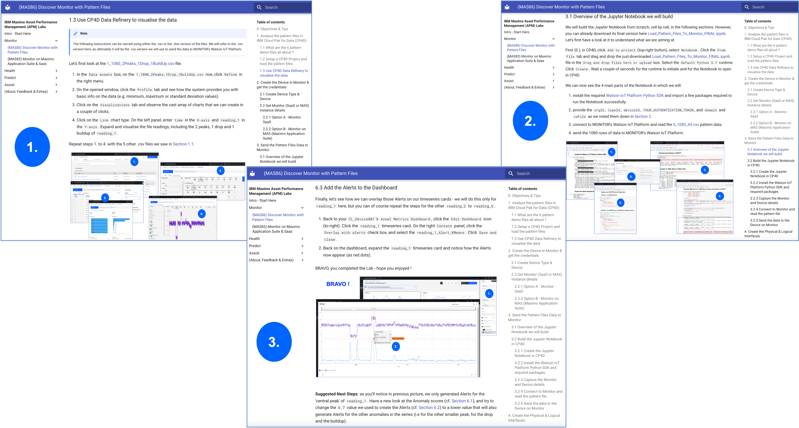
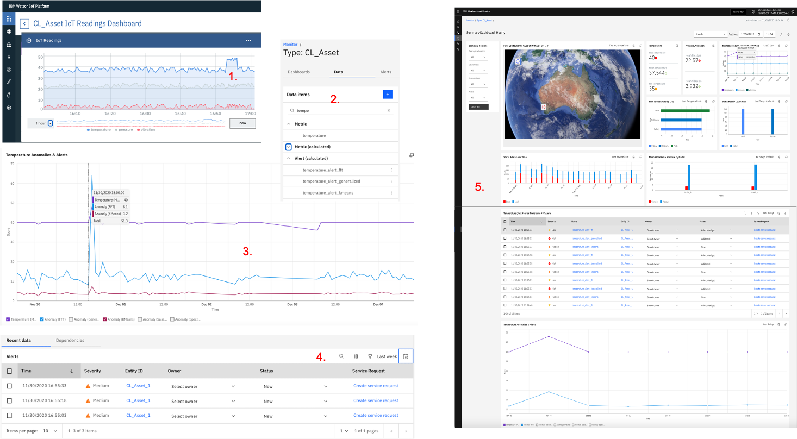
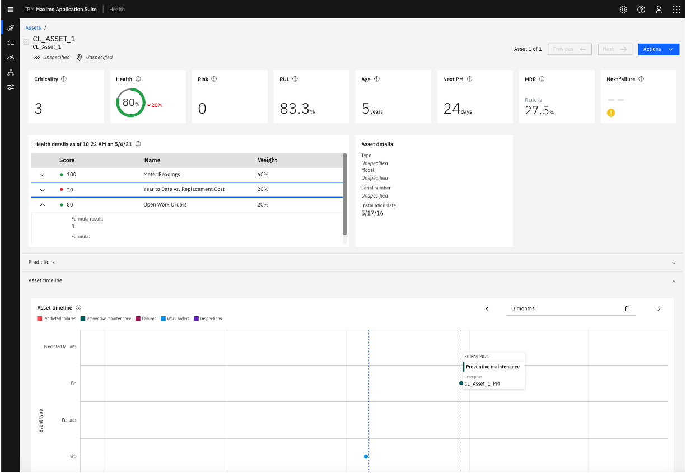
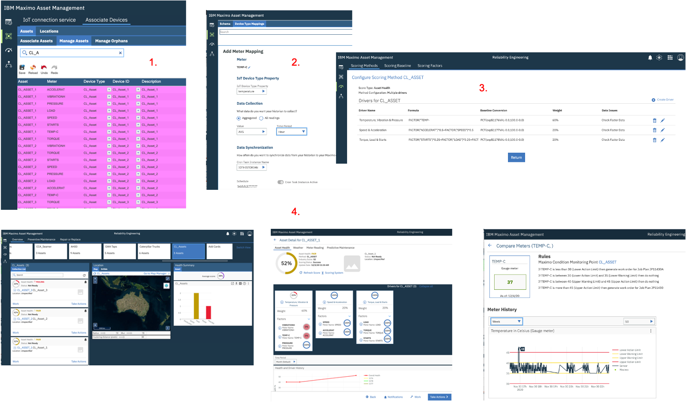
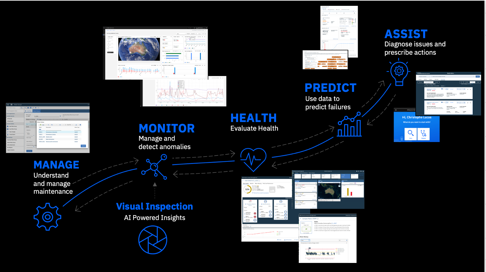

*[Page last updated on 10 January 2022]*
# IBM Maximo Asset Performance Management (APM) Labs
!!! DISCLAIMER
    All the Lab material on this site is provided as-is and does NOT represent formal IBM documentation in any way. Please send any feedback directly 
    to [Christophe Lucas](https://www.linkedin.com/in/christophe-lucas-a5abab28/).
---
## APM Labs Overview

---
### Overview & what you will do

Welcome to these Labs which will help you understand how IBM Maximo
[Manage](https://www.ibm.com/products/maximo),
[Monitor](https://www.ibm.com/products/maximo/remote-monitoring)
and [Health](https://www.ibm.com/products/maximo/predictive-maintenance#section-heading-3)
work together.
Here is an overview of the Labs presently available, followed by a short description of what you will do during those Labs.
These Labs all assume that you have a working environment with the required access rights - see [Prerequisites & Tools versions](#prerequisites-tools-versions).

| Lab Name  | Remark    | Created On | 
| ------------------------------------- |:----------------------------|:----------------------------|
|  [[NEW] Discover MONITOR with Pattern Files](monitor/monitor-patterns)          |**[NEW]**  In this Lab, you will discover and analyse 6 pattern files containing anomalies and send the pattern data to MONITOR. You will then create Anomaly Detection functions on the data, and Alerts.| H1 2022|
|  [Monitor on Maximo Application Suite 8.3 & SaaS](monitor/monitor)          |In this Lab, you will generate IoT data, create anomalous readings, detect them and create nice Dashboards. That same IoT data will be used for the subsequent Health Labs. Monitor's look & feel is the same in its SaaS version & MAS83 version - so this Lab will work for both.|H1 2021|
|  [Health on Maximo Application Suite 8.3](health/health-mas)             |This Lab can be run standalone up till its section [9. Update the Health Scoring Method](health/health-mas/#9-update-the-health-scoring-method). To complete its final step [10. [OPTIONAL] Map IoT Devices & Readings to Assets & Meter Readings](health/health-mas/#10-optional-map-iot-devices-readings-to-assets-meter-readings), you must have completed this Monitor Lab section [1. Generate IoT data](monitor/monitor/#1-generate-iot-data).		|H1 2021|
|  [Maximo Asset Health Insights 7.6.1](health/health/#0-objectives)            | To run this Lab, you must have completed this Monitor Lab section [1. Generate IoT data](monitor/monitor/#1-generate-iot-data).       				  |H2 2020|
|  Other            | Note available yet (stay tuned): [Predict on Maximo Application Suite 8.3](predict/predict) and [Assist on Maximo Application Suite 8.3](assist/assist)       				  |

In the [[NEW] Discover MONITOR with Pattern Files](monitor/monitor-patterns) lab, you will:

1. Discover and analyse 6 pattern files in MAS Cloud Pak for Data's (CP4D) Data Refinery Tool.
2. Build a Jupyter Notebook in CP4D to send the pattern data to a device in MONITOR.
3. Create Anomaly Detection functions and Alerts on the pattern data.

 &nbsp;

In the [Monitor on Maximo Application Suite 8.3 & SaaS](monitor/monitor/#0-objectives) lab, you will:

1. Create 3 IoT Devices of type `CL_Asset` and generate simulated IoT data for them. 
Focusing on the `temperature` reading, we will generate anomalous readings during a couple minutes.
2. Visualise the IoT data in Monitor and generate new data items.
3. Create `Anomaly Detection` functions that will spot the anomalous readings you generated.
4. Create `Alerts` based on the anomalies detected.
5. Create a custom dashboard that will bring everything together.

 &nbsp;

In the [Health on Maximo Application Suite 8.3](health/health-mas/#0-prerequisites-objectives) lab, you will:

* set up the required Assets and Meter Groups in Manage (aka Maximo)
* create a sample Health Scoring Method, a Criticality and a Risk Method in Health
* populate all Cards (i.e. Health Score, Criticality, Risk, RUL, Age, Next PM, MRR) on your sample `CL_Asset_1` in Health
* [OPTIONAL] finally, associate the IoT Devices we defined in the first Monitor Lab steps of 
[1. Generate IoT data](monitor/monitor/#1-generate-iot-data)
to the Manage Assets and set up the required mappings between your IoT readings 
and Maximo Assets Meter Readings.
At the end of this Lab, your `CL_Asset_1` will look like this in Health, with all its cards populated and explained.
 &nbsp;

In the [Maximo Asset Health Insights 7.6.1](health/health/#0-objectives) lab, you will:

1. set up the required mappings and associations between the `CL_Asset` *IoT Devices* and corresponding Maximo *Assets*.
2. set up the required mappings and associations between *IoT readings* and Maximo *Meter Readings*.
3. create a sample *Scoring Method* to calculate the health of your Assets.
4. Visualise the health of your Assets through a *Dashboard*. 

 &nbsp;

---
### Intended audience

These labs were conceived with the following audience in mind:

* **IBMers & Business Partners**: the main goal is to help you understand how the APM elements work and integrate.
If you go step-by-step through all the lab material, you will become able to create an end-to-end custom APM demo for any scenario or customer.

* **Anybody interested in APM**: by just scrolling through the pages of these labs, you should get a clear view
of the rich functionalities of the APM solution and how they could possibly help you on your 'Asset Optimisation' journey.

---
### Lab principles

These labs were created with the following principles in mind:

* **Fully data driven**: you will start by creating simulated IoT data.
That data will be our guide and 'golden thread' throughout all the labs: in *Monitor* you will create anomalies on it, then create
advanced visualisations of it, then, in *Health*, it is that same data that you will ultimately use to 
visualise the condition of your asset.

* **Fully Customisable**: the IoT data we will use throughout these labs consists of 8 generic readings like
`temperature`, `pressure`, `vibration`, `speed` etc. For each of those, we simulate random readings in a certain range 
e.g. `"temperature": random(35,40)`.
If you wish to simulate fewer, more or other types of readings, or change the range of values for any reading - feel free !
Similarly, we decided to use a very generic naming for the *Asset*: `YourInitials_Asset`, 
i.e. `CL_Asset` for all the labs (*CL* standing for *Christophe Lucas*). 
You can of course decide to name your Asset differently, e.g. `Pump`, `Engine`, `Conveyor Belt`, `Compressor`, `Turbine` - you name it !   
If you change the readings or asset name, the labs principles will remain exactly the same - 
you will just need to pay extra attention to your naming conventions and consistently substitue 
the names used in this material with yours ...

* **Monkey See, Monkey Do**: we have really tried to make these labs as easy and failure-proof as possible. 
For each (sub)section, a clearly numbered list of *steps* is provided, and below each list, a picture shows the screens corresponding to each step - with a `1., 2., 3. ...` red number making the mapping.
Also, if the images are too small, do not hesitate to right-click and `open in new tab` on them - 
they will appear bigger.

### What these APM Labs are not
These labs are not official IBM documentation, and are provided as-is.

## What is Asset Performance Management (APM) ?

[Asset Performance Management (APM)](https://www.ibm.com/business-operations/enterprise-asset-management/asset-performance-management)
and [Enterprise Asset Management (EAM)](https://www.ibm.com/business-operations/enterprise-asset-management)
are complementary programs.
But whereas EAM enables the *execution* of the day to day asset maintenance activities like
work scheduling, planning and work order tracking, APM is designed for *decision support*, i.e.
APM uses advanced analytics and AI to help operations, maintenance leaders, reliability engineers and technicians
make better decisions around their assets' lifecycle.  

By enabling ... 

* operations people to have an enterprise wide view of their fleets of assets and detect anomalies in near real-time, 
* reliability and maintenance professionals to track the real condition and health of assets and predict their failures,
* technicians to more quickly maintain or fix assets by providing them AI-based problem diagnosis and
expert guidance,

... a sound use of an end-to-end APM solution can help: 

* reduce unplanned downtime, shorten duration of outages, increase production output or decrease wasted time investigating false-positive alerts,
* reduce fleetwide operational risk by focusing on the right assets, increase asset availability, reduce unnecessary preventive maintenance, reduce time to make capital replacement planning decisions
* improve first time fix rate, reduce MTTR (mean time to repair), improve diagnosis accuracy and cut diagnosis time, standardize maintenance and repair processes
* reduce failures, reduce maintenance costs, improve asset utilisation, extended life of asset, and ultimately, enable 
a shift of maintenance strategies from a calendar or preventive base to a real
condition, then predictive and prescriptive base.

IBM Maximo APM is a fully integrated set of tools which is part of a yet broader 
ecosystem of IBM solutions which will help accelerate your 'Asset Optimisation' efforts. 
Those APM elements are:

* **[MANAGE](https://www.ibm.com/business-operations/enterprise-asset-management)**: this refers to the 'core' 
Maximo component which provides advanced management capabilities of your Assets' lifecycle,
including Asset definition, work orders management, planning and scheduling of your maintenance related activities etc.

* **[MONITOR](https://www.ibm.com/products/ibm-maximo-asset-performance-management/asset-monitor)**: provides enterprise scale monitoring and AI-based anomaly detection. Main capabilities include:
easily configurable dashboard (no-code widgets), 
workflow to drive ownership of issues,
auto-generation of work orders,
rapid data integration and
hierarchical data filtering and management.  

* **[HEALTH](https://www.ibm.com/products/ibm-maximo-asset-performance-management/asset-health)**: 
provides a consolidated global view of assets, health visibility and analysis, condition based actions and
replacement planning. Main capabilities include: dashboard with cards, map view, spreadsheet view, 
fleet-wide view and health drilldown, 
health based notifications and actions,
flexible health scoring by asset type or groups, 
sensor data integration, 
job plan efficacy analysis,
refurbish / replace prioritisation

* **[PREDICT](https://www.ibm.com/products/ibm-maximo-asset-performance-management/predictive-maintenance-insights)**:
provides the ability to build asset failure models, to 
predict failures, to 
determine factors that contribute to failure and to
score models with current sensor data. Main capabilities include:
templates provided to build 5 common predictive models, 
view pre-built visualizations for the 5 common models,
model scores contribute to the overall asset health in the HEALTH component.

* **[ASSIST](https://www.ibm.com/products/maximo-equipment-maintenance-assistant)**:
is an AI Assistance for field technicians which provides *Diagnosis* and *Query* capabilities.
Using historical remote assistance data like past work orders, unstructured data like OEM manuals,
as well as structured data like IoT readings, it allows technicians to: (a)  
ask questions in plain english to quickly find information relevant to the problem at hand,
(b) diagnose asset issues based on observed factors, and get recommendations for the fix.

The APM tools/elements that we will extensively use in the first version (December 2020) 
of these labs are **MANAGE**, **MONITOR** and **HEALTH**.
In future versions we will add **PREDICT** and **ASSIST**.

 &nbsp;  

## Prerequisites & Tools Versions

These APM labs assume that you have a fully working and integrated environment set up and the IDs required to access it.
The tool versions that were used to build these labs are:

| Lab Name  | Tools Versions    |
| ------------------------------------- |:----------------------------|
|  [[NEW] Discover MONITOR with Pattern Files](monitor/monitor-patterns)          |IBM MAS-MONITOR 8.6 running on IBM Cloud: January 2022.|
|  [Monitor on Maximo Application Suite 8.3 & SaaS](monitor/monitor)          |IBM Maximo Asset Monitor SaaS: November 2020 (then February 2021 for latest updates). Works on MAS83-Monitor too.|
|  [Health on Maximo Application Suite 8.3](health/health-mas)             | Running on an OpenShift Cluster on IBM Cloud: MAS83-Monitor & MAS83-Health & Maximo 7.6.1.2						  |
|  [Maximo Asset Health Insights 7.6.1](health/health)            | IBM Maximo Asset Management 7.6.1.1 & IBM Maximo APM - Asset Health Insights 7.6.1.1.       				  |
|  Other            | Note available yet (stay tuned): [Predict on Maximo Application Suite 8.3](predict/predict) and [Assist on Maximo Application Suite 8.3](assist/assist)       				  |

If you have questions about how to get access to such an environment, about how to install, 
about which exact versions 
are required, about pricing etc ... please contact you instructor or your local IBM representative.

