*[DRAFT WORK IN PROGRESS, UNDER REVIEW - Page last updated on 10 January 2022]*
# Discover MONITOR with Pattern Files

---
**PREREQUISITES & DISCLAIMER**  
!!! DISCLAIMER
    This Lab is provided as-is and does NOT represent formal IBM documentation in any way. Please send any feedback directly 
    to [Christophe Lucas](https://www.linkedin.com/in/christophe-lucas-a5abab28/).

This Lab assumes that you have:

* an ID to connect to a [MONITOR](https://www.ibm.com/au-en/products/maximo/remote-monitoring) 8.6 instance - either a SaaS instance, or a MONITOR instance 
  part of a [Maximo Application Suite](https://www.ibm.com/au-en/products/maximo) (aka MAS) installation.

* an ID to access a [Cloud Pak For Data](https://www.ibm.com/au-en/products/cloud-pak-for-data) (aka CP4D) instance. CP4D is 
  typically part of any MAS installation (as it contains e.g. the MONITOR DB2 data lake), and we recommend using your
  MAS CP4D instance to run this lab - however the instructions should also work with a 'stand-alone' CP4D.
  

This Lab was built using a Cloud Pak For Data instance and a MONITOR 8.6 instance both part of a MAS 8.6 environment 
running on [IBM Cloud](https://www.ibm.com/au-en/cloud).

---

---
## 0. Objectives & Tips

!!! TIP
    I tried to make the instructions of this Lab as (visually) clear as possible, i.e. each set of numbered instructions
    is followed by screenshots reflecting those numbers. Do not hesitate to right-click the images and *Open Image in New Tab*
    to see all the image details and zoom-in/out.

In this Lab you will:

* Discover and analyse 6 pattern files:
    * Understand why and how the 6 data patterns were constructed
    * Visualize the data and the anomalies (or 'changes of behaviour') that those 6 files contain using 
         Cloud Pak For Data (aka CP4D) Data Refinery tool
* Learn how to:
    * Create the Device in MONITOR that will receive the pattern readings 
    * Create a Jupyter Notebook on CP4D to send the content of the pattern files to the Device
    * Visualise the data on MONITOR's dashboard
    * Apply (some of) MONITOR's out-of-the-box Anomaly Detection functions on the pattern data,
    and create Alerts based on the Anomaly scores.

---

---
## 1. Analyse the pattern files in IBM Cloud Pak for Data (CP4D)

---
### 1.1 What are the 6 pattern demo files all about ?
The 6 following files were created to represent just a very few examples of 'typical behaviours and anomalies' that can 
  be observed in industrial machine readings.
They were constructed with the following ideas in mind:

* Each file contains 1080 rows of 1 reading type (generically called `reading_1`). That means that, depending on the frequency you will
  use to send the data to MONITOR's Watson IoT Platform (cf. [Section 3](#3-send-the-pattern-files-data-to-monitor)), 
  you will be able to complete a 'full iteration' of the 
  sample data in 18 minutes, a couple hours, or more - as per table below:
  
  
```python
------------------------------------------------------------------
Message Frequency ---> = Messages per Hour ---> = 1080 Demo Time   
------------------------------------------------------------------
Every 1 second    ---> 3,600 per hour ---> 18 minutes
Every 5 seconds   ---> 720 per hour   ---> 1 hour 30 minutes
Every 10 seconds  ---> 360 per hour   ---> 3 hours 
Every 30 seconds  ---> 120 per hour   ---> 9 hours
```

* Each file contains some anomalies (or 'changes of behaviour') that are pretty visible to the naked eye. The goal is to see in the last 2 
sections of this Lab ([Section 5](#5-create-anomaly-functions-to-detect-pattern-file-anomalies-in-monitor) & [Section 6](#6-create-alerts-based-on-the-anomalies-detected))
  how (some of) MONITOR's out-of-the-box
  [Anomaly Detection](https://www.ibm.com/docs/en/maximo-monitor/8.6.0?topic=data-detecting-anomalies) functions
  pick those anomalies up, and how Alerts can be created using the Anomaly scores of those functions.
  
* For each file, I provided .csv and .xlsx versions. The reason I provided the .xlsx format is that you
can have a look at how I manually built those files, about 50 rows by 50 rows, using the simplest Excel formula
  to generate random data between values (for example, `=10.4+1*RAND()` means `generate a random number between 10.4 and 11.4`).
  With that, you should easily be able to create your own new .xlsx files by changing just some rows in the .xlsx.


The 6 files (cvs and xlsx format), as well as a `0_1080_All` file which concatenates those 
6 files readings into 1 file, have all been zipped into [All_Pattern_Files.zip](../files/monitor-patterns-data/All_Pattern_Files.zip).

The table below summarises the data that each file contains:


| File Name  | Data Overview    |
| ------------------------------------- |:----------------------------|
| <b>1_1080_2Peaks_1Drop_1BuildUp</b> ([.csv](../files/monitor-patterns-data/1_1080_2Peaks_1Drop_1BuildUp.csv), [.xlsx](../files/monitor-patterns-data/1_1080_2Peaks_1Drop_1BuildUp.xlsx)) <br> Continuous readings of random values between 10 & 11 (i.e. `=10+1*RAND()` ), with 4 noticeable events: <br> (1) a drop to values between 7 & 8 (rows 200 to 250). <br> (2) a peak to values between 12 & 13 (rows 350 to 380), <br> (3) a small spike buildup with values up to `=10.8+1*RAND()` (rows 500 to 515). <br> (4) a small 'buildown' where values progressively drop down to `=9.3+1*RAND()` (rows 600 to 680).    |&nbsp;
| <b>2_1080_Sinus_1Peak_2Drops</b> ([.csv](../files/monitor-patterns-data/2_1080_Sinus_1Peak_2Drops.csv), [.xlsx](../files/monitor-patterns-data/2_1080_Sinus_1Peak_2Drops.xlsx))<br> A sinusoidal type of input, with 3 noticeable events: <br> (1) a dropdown (rows around 323). <br> (2) another dropdown (around row 627), <br> (3) a spike (around row 839)             |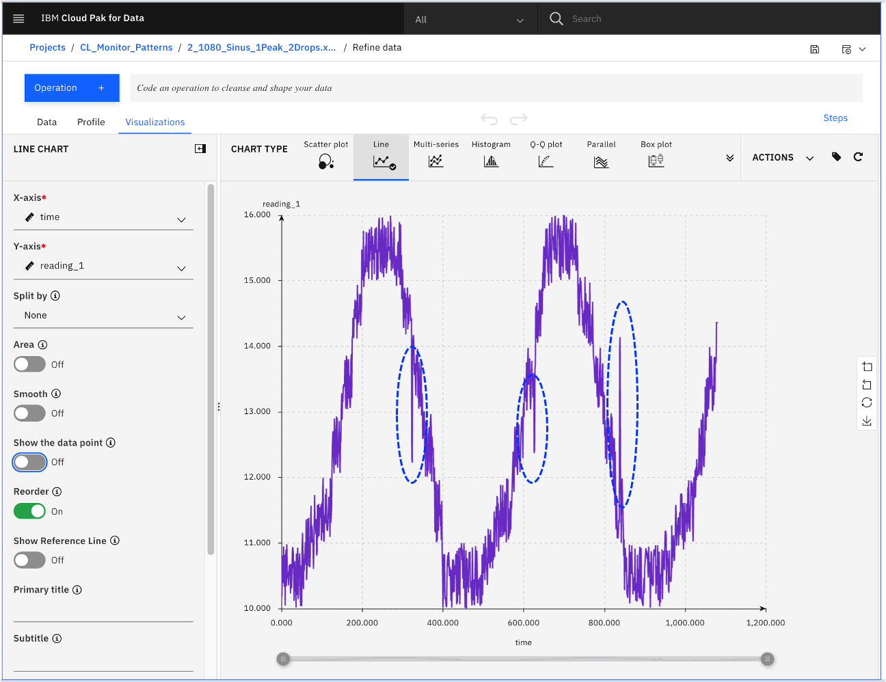&nbsp;
| <b>3_1080_Sinus_2Woblings</b> ([.csv](../files/monitor-patterns-data/3_1080_Sinus_2Woblings.csv), [.xlsx](../files/monitor-patterns-data/3_1080_Sinus_2Woblings.xlsx))<br> Some strange things going on here, i.e. amplitude change between rows 400 and 550 (vs. the standard sinusoidal-like background) ...         | 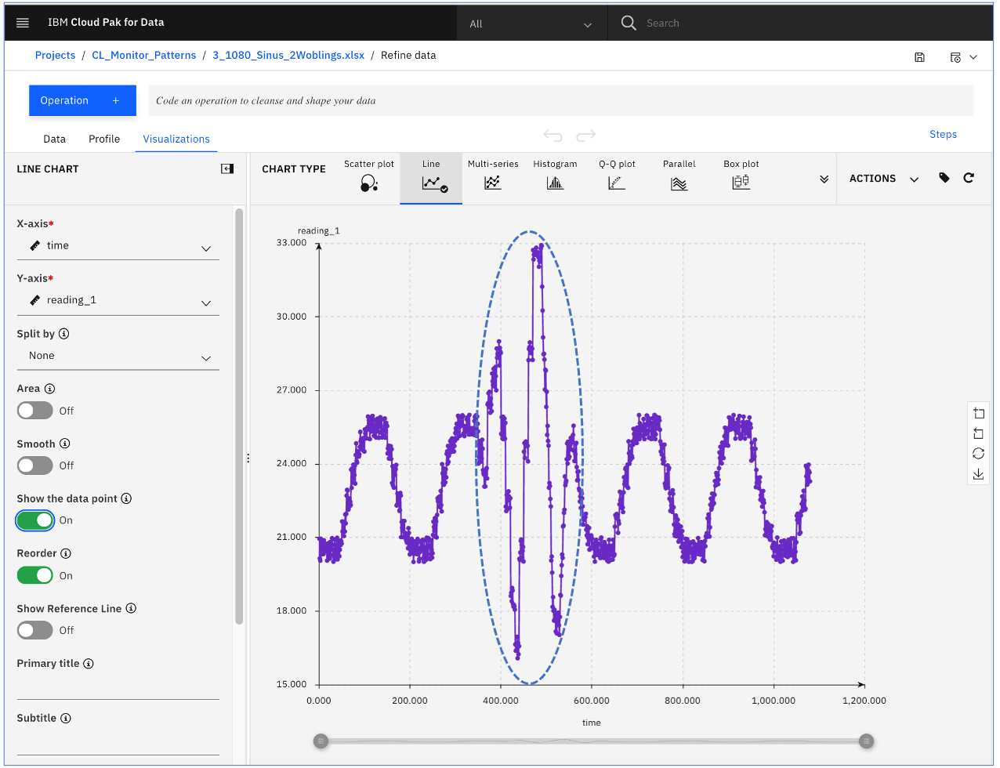&nbsp;
| <b>4_1080_Sinus_SignalLoss</b> ([.csv](../files/monitor-patterns-data/4_1080_Sinus_SignalLoss.csv), [.xlsx](../files/monitor-patterns-data/4_1080_Sinus_SignalLoss.xlsx))<br> On this one, notice that between rows 370 and 470, a constant value of 23 is sent, 'breaking the sinus' ...           | 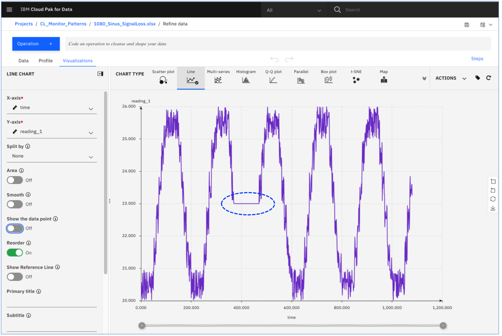&nbsp;
| <b>5_1080_Plateaus</b>  ([.csv](../files/monitor-patterns-data/5_1080_Plateaus.csv), [.xlsx](../files/monitor-patterns-data/5_1080_Plateaus.xlsx))<br> Here, we have several plateaus of values. Let's see later if the Anomaly Detection functions react each time there is a plateau change ...          | 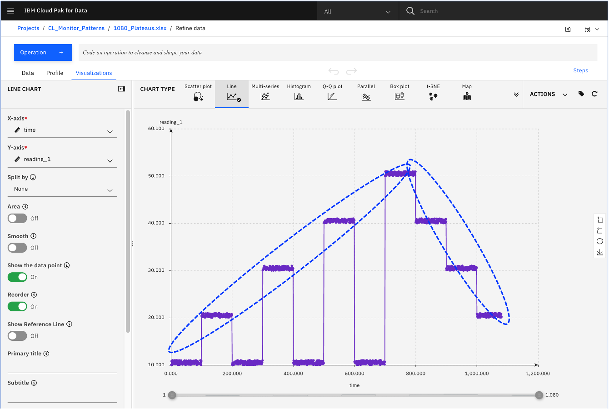&nbsp;
| <b>6_1080_Amplitude_Changes</b> ([.csv](../files/monitor-patterns-data/6_1080_Amplitude_Changes.csv), [.xlsx](../files/monitor-patterns-data/6_1080_Amplitude_Changes.xlsx))<br> This shows a varying signal which amplitude regularly changes.            | 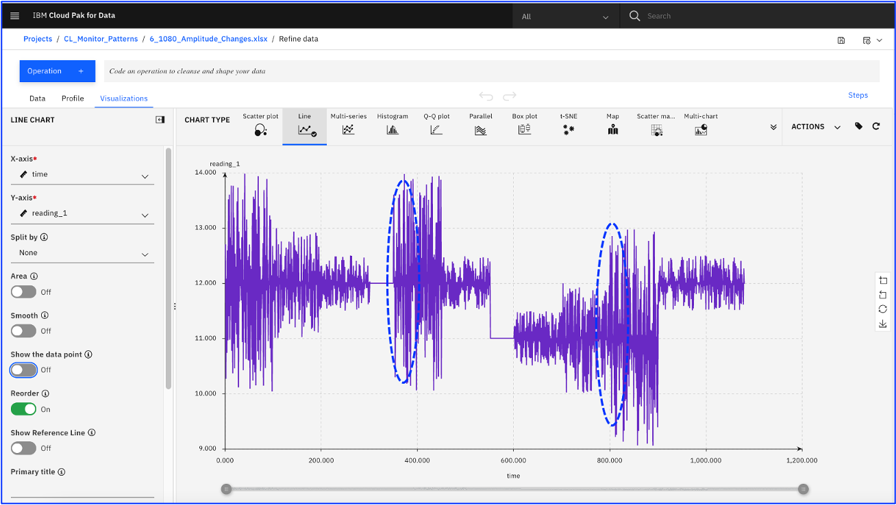&nbsp;
| <b>0_1080_All</b> ([.csv](../files/monitor-patterns-data/0_1080_All.csv), [.xlsx](../files/monitor-patterns-data/0_1080_All.xlsx).)<br> This last graph shows the 'concatenated readings' of all 6 previous files, i.e. `reading_1` corresponds to `1_1080_2Peaks_1Drop_1BuildUp.csv` readings, `reading_2` corresponds to `2_1080_Sinus_1Peak_2Drops.csv` readings, `reading_3` corresponds to `3_1080_Sinus_2Woblings.csv` etc              | 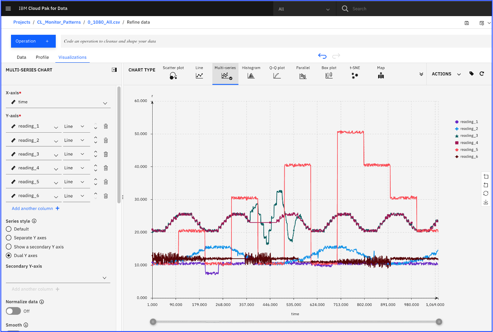&nbsp;


---
### 1.2 Setup a CP4D Project and load the pattern files

Let's first create the CP4D Project that we will use to load and visualise the data, then to build the Jupyter Notebook 
that will send the data to MONITOR.

1. Login to CP4D and click `New project` in the `Recent Projects` box. 
   Select `Create an empty project`.
2. Name your Project e.g. `CL_Monitor_Patterns` (replace `CL_` with your own initials). 
   Click `Create`. 
&nbsp; 
   
Download the zip file [All_Pattern_Files.zip](../files/monitor-patterns-data/All_Pattern_Files.zip).
Unzip it on your local drive.
In your newly created `CL_Monitor_Patterns` project:

1. Click on the `Assets` tab and on the top-right `Data` icon. This will open a right-side 
   window. On the `Load` tab, just drag and drop the 2 x 6+1 Pattern Files (.csv and .xlsx formats).
   
2. After a couple of seconds, those 14 files will appear under the `Data Assets` section of the `Assets` tab. 

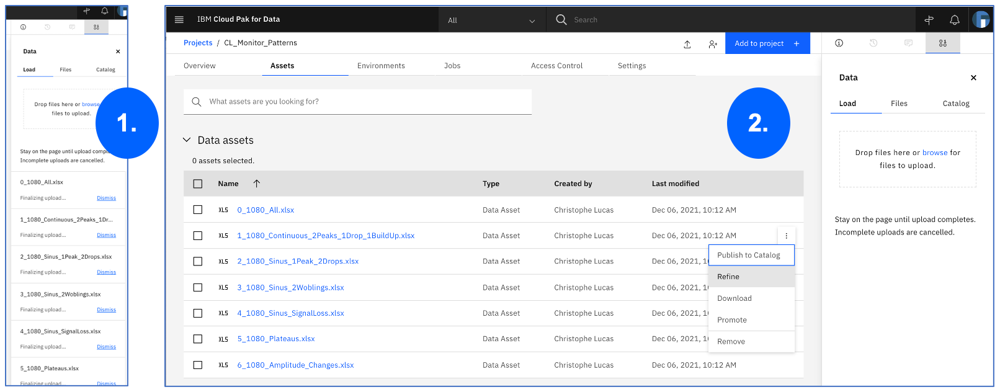&nbsp; 


---
### 1.3 Use CP4D Data Refinery to visualise the data

!!! NOTE
    The following instructions can be carried using either the .csv or the 
    .xlsx files. We will refer to the .csv versions here, as ultimately it will be the .csv version we will 
    use to send the data to MONITOR's Watson IoT Platform.  

Let's first look at the [1_1080_2Peaks_1Drop_1BuildUp.csv](../files/monitor-patterns-data/1_1080_2Peaks_1Drop_1BuildUp.csv)
file.

1. In the `Data assets` box, on the `1_1080_2Peaks_1Drop_1BuildUp.csv` row, click `Refine` in the right menu.
2. On the opened window, click the `Profile` tab and see how the system provides you with
   basic info on the data (e.g. minimum, maximum or standard deviation values).
3. Click on the `Visualizations` tab and observe the vast array of charts that we can create in a couple of clicks.
4. Click on the `Line` chart type. On the left panel, enter `time` in the `X-axis` and `reading_1` in the `Y-axis`.
Expand and visualise the file readings, including the 2 peaks, 1 drop and 1 buildup of `reading_1`.
   
Repeat steps 1. to 4. with the 5 other .csv files we saw in [Section 1.1](#11-what-are-the-6-pattern-demo-files-all-about).

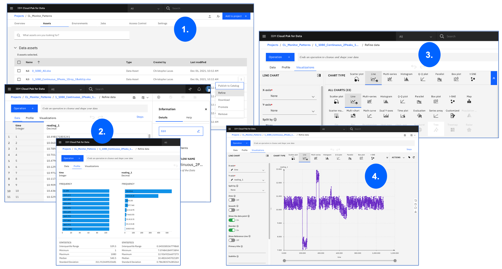&nbsp;

Now, let's look at some of the other chart types that can be quickly created in CP4D. 
The following image illustrates just some examples:

1. A `3D` chart where we selected `time` as the `X-axis`, `reading_1` (corresponding to the `1_1080_2Peaks_1Drop_1BuildUp.csv` file readings)
   as both the `Y-axis` and `Z-axis`. See how we clearly see the peaks, drops and buildups there.
2. A `Box Plot` chart where we selected `reading_3` (corresponding to the `3_1080_Sinus_2Woblings.csv` file readings) as the `Column`.
    Notice how we clearly see the outliers here, corresponding to the 'Woblings' readings.
3. A `Histogram` chart, where we selected `reading_4` (corresponding to the `4_1080_Sinus_SignalLoss.csv` file readings) as the `X-axis`.
    Notice the main central bar corresponding to those 'flat readings' of value 23.
4. Here, we can clearly see on a `Scatter Plot` the 3 main 'groups of amplitude' that can be seen on `reading_6`
   (corresponding to the `6_1080_Amplitude_Changes.csv` file readings)

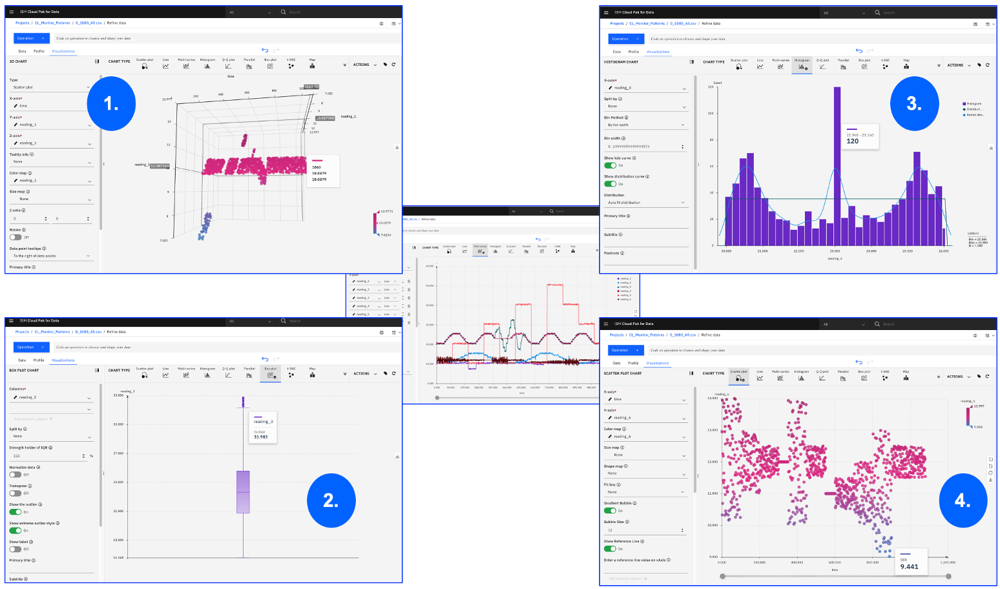&nbsp;

---

---
## 2. Create the Device in Monitor & get the credentials

!!! ATTENTION
    Make sure that in this section' exercises, you take note of the following values which
    we will later need in the [Section 3.2.3](#323-capture-the-monitor-and-device-details-and-read-the-pattern-file):
    `orgId`, `typeId`,`deviceId`, `YOUR_AUTHENTICATION_TOKEN`, and, 
    additionally for a MONITOR-on-MAS instance: `domain` and `caFile`.

---
### 2.1 Create Device Type & Device
In this step, take note of `orgId`, `typeId`, `deviceId`, `YOUR_AUTHENTICATION_TOKEN`.

From your MONITOR home page, click the `Connect` menu in the left bar, and go to the `Device types` tab.

1. Click the blue `Add new device type` button (top-right). Name it e.g. `CL_Device` (replace the `CL_` with your initials).
   Click the `Create Device type` button.
2. Go to the `Devices` tab, click `Add a device`, click `Use existing type` and select the `CL_Device` device type you just created.
   Click `Next`. On the `Identity` step, Name the device e.g. `CL_Device001`. Click `Next`. On the `Security` step, 
   enter an `Authentication Token` of your own.
3. The `Summary` screen summarizes the info you just entered. 
   **IMPORTANT** Make sure that on this screen, you take note of
   `Organization ID` (= `orgid`), `Device Type` (= `typeId`), `Device ID` (= `deviceId`), `Authentication Token` (=`YOUR_AUTHENTICATION_TOKEN`). 
   Click `Finish`.
   
**NOTE:** The `orgID` we just took note of is the Organization ID of the Watson IoT Platform associated to your MONITOR instance.
Refer to next section to confirm the value of that `orgID`.
   
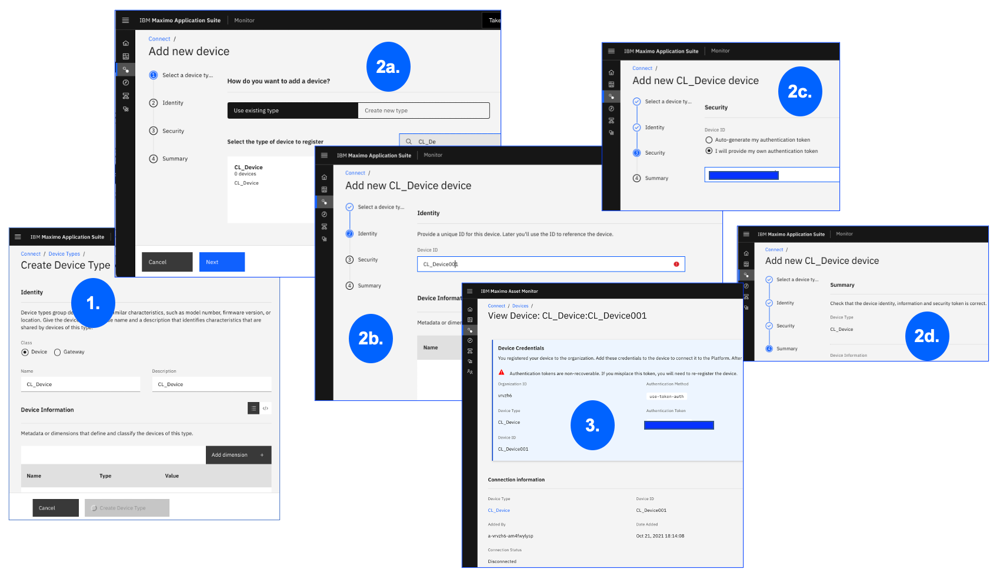&nbsp;

---
### 2.2 Get Monitor (SaaS or MAS) Instance details 
In this step, confirm the `orgID` of the Watson IoT Platform associated to your MONITOR instance (SaaS or MAS), 
and, for MONITOR-on-MAS only, find and take note of `domain` and `caFile`.

Follow **either** Option A **or** Option B below (**not both**), depending on your MONITOR instance.

#### 2.2.1 Option A - Monitor SaaS
For a MONITOR SaaS instance, the only instance info that we will need for [Section 3.2](#32-build-the-jupyter-notebook-in-cp4d)
is the `orgID` that we just took note of in [Section 2.1](#21-create-device-type-device).
Confirm the value of that `orgID` by doing this:
From your MONITOR `Connect` menu, click `Open Platform Service application` button (top-right).
That will open the Watson IoT Platform in a separate tab - observe its URL.

Below is an example of how to confirm your `orgID` based on your MONITOR's Watson IoT Platform URL: 

```
------------------------------------------------------------------
OPTION A - MONITOR SaaS Example
------------------------------------------------------------------
IF your MONITOR Watson IoT Platform address is:
https://abc123.internetofthings.ibmcloud.com/dashboard/
THEN orgID = abc123
```

#### 2.2.2 Option B - Monitor on MAS (Maximo Application Suite)
For a MONITOR instance on MAS, we need 2 extra pieces of info: `domain` and `caFile`.

Let's first get the required certificate, i.e. the `caFile` file.
Using a Firefox browser:

1. From your MAS or MONITOR Homepage, click the waffle menu (top-right), select `IoT` in the `My applications` list.
   That will open the Watson IoT Platform in a separate tab.
2. In the Watson IoT Platform browser bar, click the Security icon just next to the URL. Click the `Connection Secure` line.
3. Then click the `More information` line. That will open a pop-up window.
4. On the popped-up window, click `View Certificate`. That will open a new tab on your browser.
5. On the opened `Certificate` browser tab, click the `ISRG Root X1` tab. In the `Miscellaneous` section, click
   the `PEM (chain)` link. That will download a file which name should look like: `iot-maximoabc-yourcloud-info-chain.pem`.
   Save it to your local `Downloads` folder. **NOTE**: that is the file that we will use as our `caFile` in 
   [Section 3.2](#32-build-the-jupyter-notebook-in-cp4d).
6. Back to CP4D's `Assets` tab, click the little top-right `Find and add data` waffle and drag and drop the
`iot-maximoabc-yourcloud-info-chain.pem` file you just downloaded. Make sure it then appears on the 


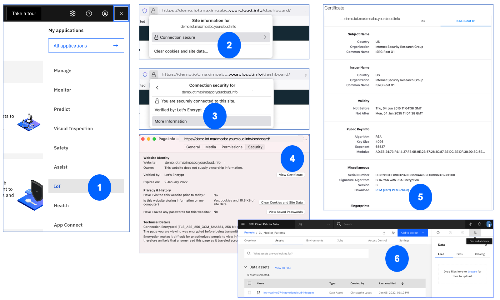&nbsp; 

To confirm your `orgID`, and to get the `domain` value of the Watson IoT Platform associated to your MAS-MONITOR instance, 
observe the URLs of your MAS, MAS-MONITOR and MAS-MONITOR-WatsonIoTPlatform Homepages, and follow the example below:

```
------------------------------------------------------------------
OPTION B - MONITOR on MAS (Maximo Application Suite) Example
------------------------------------------------------------------
IF 'MAS Homepage' URL looks like this:
https://demo.home.maximoabc.yourcloud.info/

THEN 'MAS - MONITOR Homepage' URL should look like this:
https://demo.monitor.maximoabc.yourcloud.info/home

THEN 'MAS - MONITOR - Watson IoT Platform Homepage' should look like this:
https://demo.iot.maximoabc.yourcloud.info/dashboard/

THEN & THEREFORE:
orgID = demo
domain = iot.maximoabc.yourcloud.info

```

---

---
## 3. Send the Pattern Files Data to Monitor

Great - we now know which data we want to send, and have collected all the information we need to 
start sending it to MONITOR's Watson IoT Platform.
We will now use a Jupyter Notebook to connect to the platform, and send the data to it. 

---
### 3.1 Overview of the Jupyter Notebook we will build
We will build the Jupyter Notebook from scratch, cell by cell, in the following sections.
However, you can already download its final version here [Load_Pattern_Files_To_Monitor_FINAL.ipynb](../notebooks/Load_Pattern_Files_To_Monitor_FINAL.ipynb).
Let's first have a look at it to understand what we are aiming at.

First (0.), in CP4D, click `Add to project` (top-right button), select `Notebook`. Click the `From File`
tab and drag and drop the just-downloaded [Load_Pattern_Files_To_Monitor_FINAL.ipynb](../notebooks/Load_Pattern_Files_To_Monitor_FINAL.ipynb) file
in the `Drag and drop files here or upload` box. 
Select the `Default Python 3.7` runtime. Click `Create`.
Wait a couple of seconds for the runtime to initiate and for the Notebook to open in CP4D.

We can now see the 4 main parts of the Notebook in which we will:

1. install the required [Watson IoT Platform Python SDK](https://ibm-watson-iot.github.io/iot-python/) and import a few 
   packages required to run the Notebook successfully.
2. provide the `orgId`, `typeId`, `deviceId`, `YOUR_AUTHENTICATION_TOKEN`, and `domain` and `caFile` as we noted them down in
    [Section 2](#2-create-the-devices-in-monitor-get-the-credentials).
3. connect to MONITOR's Watson IoT Platform and read the [0_1080_All.csv](../files/monitor-patterns-data/0_1080_All.csv) pattern data.
4. send the 1080 rows of data to MONITOR's Watson IoT Platform.


&nbsp;


---
### 3.2 Build the Jupyter Notebook in CP4D

#### 3.2.1 Create the Jupyter Notebook in CP4D
From the `Assets` tab in CP4D:

1. Click `Add to project` top-right button, select `Notebook`.
2. Give the Notebook a name: `Load_Pattern_Files_to_Monitor` and select the `Default Python 3.7` runtime. Click `Create`.
3. Your (blank) Notebook should now open.

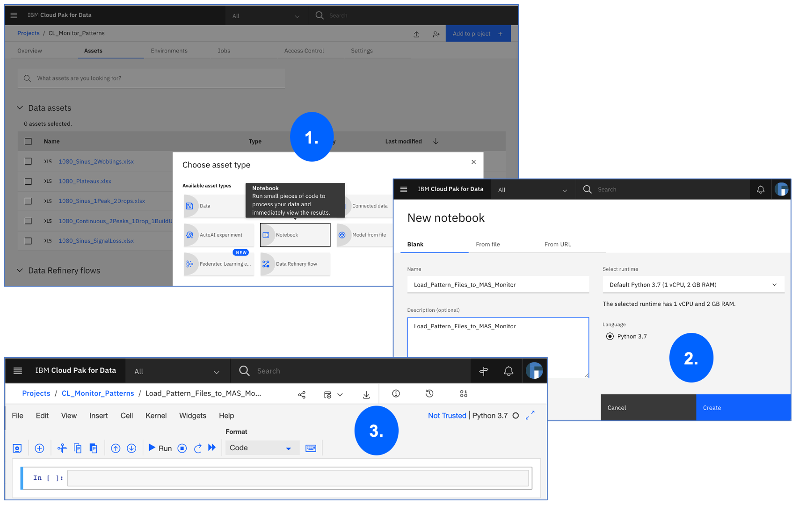&nbsp;

#### 3.2.2 Install the Watson IoT Platform Python SDK and required packages
Let's use the [Watson IoT Platform Python SDK](https://ibm-watson-iot.github.io/iot-python/),
and re-use the simplest possible code snippet (copy-pasted from the SDK's [Publishing Device Events](https://ibm-watson-iot.github.io/iot-python/application/mqtt/events/#publishing-device-events) topic)
to send data to the `CL_Device001` we registered in section [Section 2.1](#21-create-device-type-devices) section. In the Notebook we just created:

1. In the first cell of the Notebook, type `# Install the Watson IoT Platform Python SDK`
   and select `Markdown` in the `Format` toolbar. Click `Run` - this is just a header, not code.
   
    Let's now install the Python SDK itself. From the Notebook `Insert` menu, click `Insert Cell below`.
   Select `Code` in the `Format` toolbar and enter this content in the cell:
   
    ```python
    pip install wiotp.sdk
    ```
   
    Click the `Run` button in the toolbar. This installation will take 5 to 10 seconds. Look for the message at the end of the output console, which should look like this:
   `Successfully installed ... wiotp.sdk`.
   Note: you may need to restart the kernel to use updated packages.
   From the `Kernel` menu, click `Restart Kernel`, and wait a couple seconds. 
   **OPTIONAL**: you can double-check the SDK was installed successfully by inserting a new cell, issuing a `pip list` command, and checking that
   it returns *wiotp-sdk 0.11.0* as an installed package.


2. From the Notebook `Insert` menu, click `Insert Cell below`. Type `# Import the (few) required packages`
   and select `Markdown` in the `Format` toolbar. Click `Run` - this is just a header, not code.
   Insert another cell, select `Code` in the `Format` toolbar, and enter this content in the cell and click the `Run` button in the toolbar - note that will not generate any output.
   
```python
import wiotp.sdk.device
import pandas as pd
import time
import argparse
from datetime import datetime
```

&nbsp;

#### 3.2.3 Capture the Monitor and Device details
We are now going to capture the 'configuration details' required to connect to then send the 
[0_1080_All.csv](../files/monitor-patterns-data/0_1080_All.csv) pattern file data 
to the `CL_Device001` we created in [Section 2.1](#21-create-device-type-device).
There are 2 options, depending on whether your Monitor runs as a SaaS installation (Option A),
or as part of a Maximo Application Suite (MAS) installation (Option B).

Collect the values that we noted in [Section 2](#2-create-the-device-in-monitor-get-the-credentials), i.e. `orgId`, `typeId`,`deviceId`, `YOUR_AUTHENTICATION_TOKEN`, and, 
    additionally for a MONITOR-on-MAS instance: `domain` and `caFile`.

From the Notebook `Insert` menu, use `Insert Cell below` to create `Markdown` cells as per image below.
Create 1 `Code` cell, and copy-paste 1 of the following code snippet (Option A or B - depending on your MONITOR env) 
into the cell, and replace the `orgId`, `typeId` etc with the values you just collected. 

Click `Run` - note that will not generate any output.
&nbsp;
1.** OPTION A: MONITOR SaaS **
```python
# OPTION A: For MONITOR SaaS

import wiotp.sdk.device

myConfig = { 
    "identity": {
        "orgId": "YOUR_ORGID",
        "typeId": "YOUR_Device",
        "deviceId": "YOUR_Device001"
    },
    "auth": {
        "token": "YOUR_AUTHENTICATION_TOKEN"
    }
}
```

2.** OPTION B: MONITOR as part of MAS **
```python
# OPTION B: For MONITOR on MAS (Maximop Application Suite)

import wiotp.sdk.device

myConfig = { 
    "identity": {
        "orgId": "YOUR_ORGID",
        "typeId": "YOUR_Device",
        "deviceId": "YOUR_Device001"
    },
    "auth": {
        "token": "YOUR_AUTHENTICATION_TOKEN"
    },
    "options": {
        "domain": "iot.maximoabc.yourcloud.info",
        "http":{
            "verify": "True"
        },
        "mqtt":{
            "port":443,
            "caFile": "/project_data/data_asset/iot-maximoabc-yourcloud-info-chain.pem"
        }
    }
}
```

#### 3.2.4 Connect to Monitor and read the pattern file
We can finally connect to the `Device001` on MONITOR's Watson IoT Platform 
using the `myConfig` (Option A or B) we defined in the previous section/cell.


1\. From the Notebook `Insert` menu, click `Insert Cell below`. Copy-paste the below code, and `Run` the cell.
```python
deviceCli = wiotp.sdk.device.DeviceClient(config=myConfig)
print(myConfig)
deviceCli.connect()
```

Notice that we are using the `connect()` method of the [Watson IoT Platform - Python Device SDK](https://ibm-watson-iot.github.io/iot-python/device/) 
`wiotp.sdk.device.DeviceClient`, using `myConfig`. The red output of the cell should be a string (cf. 1. in image below) containing `wiotp.sdk.device.client.DeviceClient  INFO    Connected successfully`.
    
2\. Remember the [0_1080_All.csv](../files/monitor-patterns-data/0_1080_All.csv) (included in [All_Pattern_Files.zip](../files/monitor-patterns-data/All_Pattern_Files.zip))
we loaded to CP4D in [Section 1.2](#12-setup-a-cp4d-project-and-load-the-pattern-files) ?
Let's now read it into a pandas `monitor_patterns_readings` dataframe that we will then use to send the data.
Insert a new `Code` cell and copy-paste the following code:
```python
monitor_patterns_readings = pd.read_csv('/project_data/data_asset/0_1080_All.csv',
                 index_col=False)
monitor_patterns_readings.info()
```
`Run` the cell. The output should confirm that the file has 1080 rows of `reading_1` to `reading_6` readings.

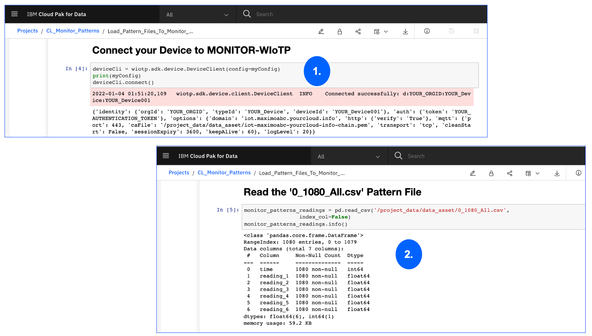&nbsp;


#### 3.2.5 Send the data to the Device on Monitor
This is the key part of the Notebook, where we finally send the pattern data to `CL_Device001` on MONITOR's Watson IoT Platform.
The code is pretty self-explanatory, i.e. it loops over the 1080 rows of the `monitor_patterns_readings` dataframe,
publishes an event for each (`publishEvent(...)`), and does a `disconnect()` when all rows have been read.

Do notice the
`parser.add_argument("-D", "--delay", required=False, type=float, default=5, help="number of seconds between msgs")`
line where you can define the frequency of your 'data sending' (cf. table in [Section 1.1](#11-what-are-the-6-pattern-demo-files-all-about)),
e.g. using `default=5` means a message is sent every 5 seconds, i.e. it will take 1.5 hour for the 1080 rows to be sent. 

1\. From the Notebook `Insert menu`, click `Insert Cell below` and copy-paste the below code snippet into it.
Click `Run`. 

This cell will keep running for the duration of the 1080 rows 'iteration'.
Every e.g. 5 seconds, you will see one new message in the output console, which should look like this:
`{'reading_1': 10.59574274, 'reading_2': 10.80853745, 'reading_3': 20.87205928, 'reading_4': 20.10878476, 'reading_5': 10.17112379, 'reading_6': 10.32845991}
======SUCCESS====== 2022-01-06 08:29:27.415862 ===Row: 1 Success: True`.
Also note that at the end of the '1080-iteration', you will get a final `Dicsonnected from the Watson IoT Platform` message.

```python
for index, row in monitor_patterns_readings.iterrows():
    data = {'reading_1': row['reading_1'],
            'reading_2': row['reading_2'],
            'reading_3': row['reading_3'],
            'reading_4': row['reading_4'],
            'reading_5': row['reading_5'],
            'reading_6': row['reading_6']
            }
    print(data)

    parser = argparse.ArgumentParser()
    parser.add_argument("-E", "--event", required=False, default="event", help="type of event to send")
    parser.add_argument("-N", "--nummsgs", required=False, type=int, default=1, help="send this many messages before disconnecting")
    
    parser.add_argument("-D", "--delay", required=False, type=float, default=5, help="number of seconds between msgs")
    args, unknown = parser.parse_known_args()

    def myOnPublishCallback():
        print()

    success = deviceCli.publishEvent(args.event, "json", data, qos=0, onPublish=myOnPublishCallback)
    now = datetime.now()
    print("======SUCCESS======", now, "===Row:", index,"Success:", success)
    if not success:
        print("Not connected to WIoTP")

    time.sleep(args.delay)
    
deviceCli.disconnect()

```

2\. Let's now check that the data is flowing into MONITOR's Watson IoT Platform.
Back to your MONITOR Homepage, click the `Connect` menu (left-side bar) and go to the `Devices` tab. 
Search and select `CL_Device001`. Wait a couple of seconds, and you will see on the `Recent events` section
that new MQTT messages pop up at the frequency you definedn (e.g. every 5 seconds).


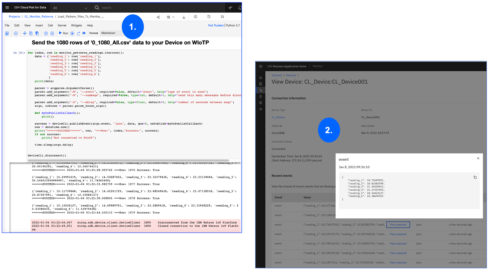&nbsp;

---

---
## 4. Create the Physical & Logical Interfaces
In order for the pattern data to land into MONITOR's data lake, we now need to create both Physical and Logical Interfaces.

---
### 4.1 Create the Physical Interface
Go back to your MONITOR Homepage.

1. Click the `Connect` left-menu. Go to the `Device types` tab. Enter`CL_Device` in the search field.
Click on the `CL_Device` row. On the opened screen, click `Edit` (top-right). Scroll down to the `Data from devices - physical interface` section.
Click the `+` button next to the `Event Types` label and select `From received event`.
2. Within a couple of seconds, the `reading_1` to `reading_6` of the [0_1080_All.csv](../files/monitor-patterns-data/0_1080_All.csv) data
that we started sending in [Section 3.2.4](#324-send-the-data-to-the-device-on-monitor) should appear. Click the `event` box. Click `Create`.
3. You should now see `reading_1` to `reading_6` appear in the `event` frame. Click `Save and finish` (bottom-right).   

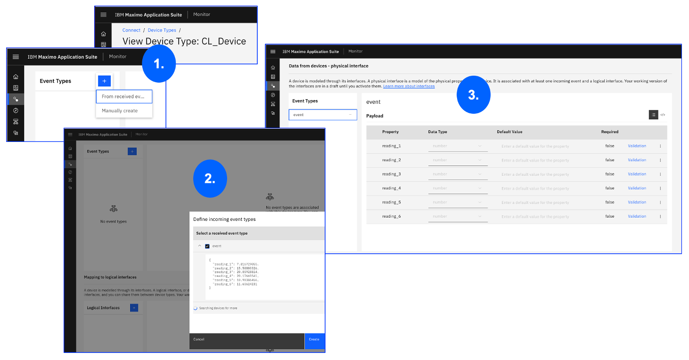&nbsp;

---
### 4.2 Create the Logical Interface and Mappings
From your MONITOR Homepage:

1. Click the `Connect` left-menu. Go to the `Interfaces` tab. Click the `Add new interface` button.
Name the Interface `CL_Device`. 
   
    In the `schema` section, click the `Add property` button, and add `reading_1` in `Property`
and `number` as the `Data Type`. Repeat this for `reading_2` to `reading_6`. Click `Create interface` button (bottom).

2. Go back to the `Device types` tab, find and select the `CL_Device` device type. Click `Edit` (top-right).
   Go to the `Mapping to logical interfaces` section. Click the `+` button next to the `Logical Interfaces`.
   
    In the pop-up window, search and select the `CL_Device` Logical Interface we just created and click the 
   `Start mappings` button. Back to the `Mapping to logical interfaces` section, click the `Edit mappings` button on the right. 
   
    In the pop-up window, select `event` in the `Event Types` left panel, and
   click the `Add mapping +` button next to `reading_1`. In the `Mapping` column, enter this string: `$event.reading_1`.
   Repeat this for `reading_2` to `reading_6`. Click the `Close` button.
   
3. Back to the `Mapping to logical interfaces` section, change the `State Model` drop-down value to `Notify on every event`.
Click `Save and finish`. 
   
This (see 3. in picture below) is what your screen should now look like. 

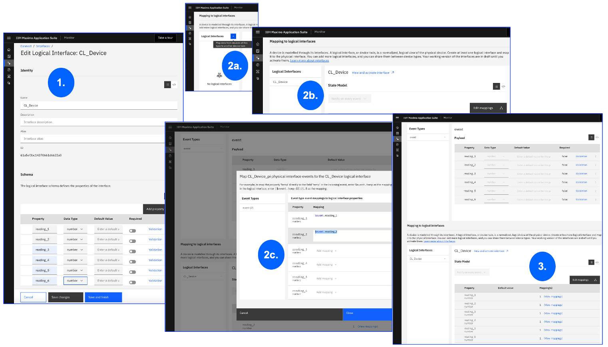&nbsp;

Finally, we now need to activate the Logical Interface.

1. On the `Mapping to logical interfaces` section, click the `View and activate interface` blue link.
   
2. That will open the `CL_Device` Logical Interface where you should now see in the top-right a green message
   stating `All device types ready to activate`. Go to the `Usage` section at the bottom of the screen and click 
   `Activate All` - you will now see a green `Activated on ...` message (top-right).
   
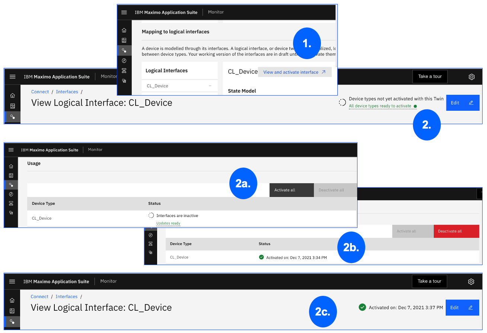&nbsp;

That concludes the setup of the interfaces. 
Data will now soon arrive (wait 5 minutes) into the MONITOR data lake.
Let's check !

---
### 4.3 View the data in ootb Dashboards
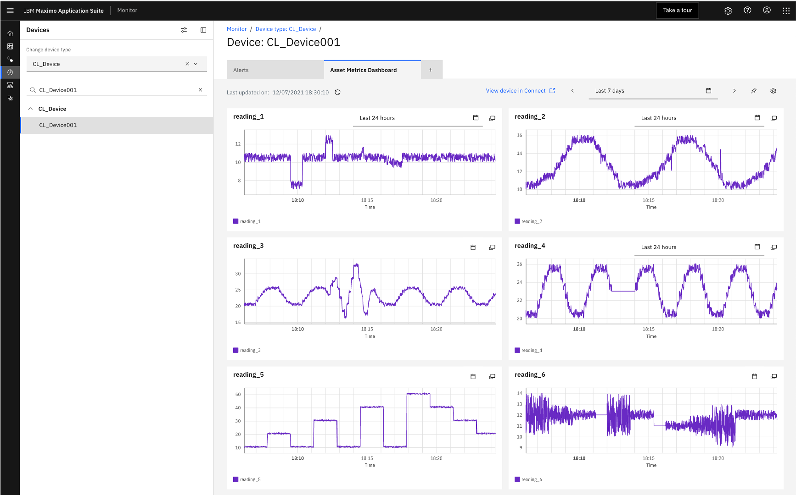&nbsp;

---
## 5. Create Anomaly Functions to detect Pattern file anomalies in Monitor

---
### 5.1 Create Anomaly Functions

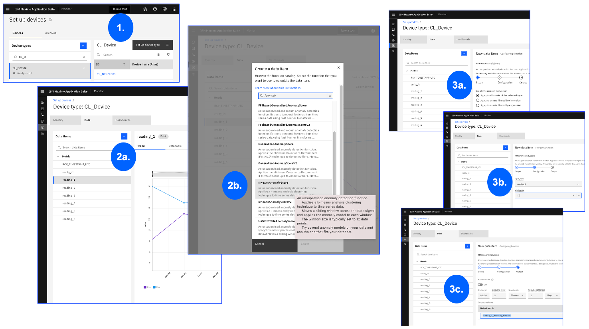&nbsp;

---
### 5.2 Add Anomaly Scores to the Dashboard


## 6. Create Alerts based on the Anomalies detected


 