*[Page last updated on 10 January 2021]*
# MONITOR Lab
!!! Attention
    **January 2022 Note**
      
      This Lab was built in H1 2021 on a MONITOR instance part of a MAS 8.3 (Maximo Application Suite) installation.
      Since then, MAS and MONITOR have moved to version 8.6 (and should soon be at 8.7), so some screens in this Lab have changed - although the 'overall logic' remains valid.
      
      I will NOT update this Lab to MAS 8.6. 

      Rather, I encourage you to follow this brand **NEW MONITOR Lab (for MAS 8.6)
      [Discover MONITOR with Pattern Files](https://christophelucasibm.github.io/apmlabs/monitor/monitor-patterns/)**,
      where you will discover pattern files using MAS Cloud Pak for Data, 
      create Jupyter Notebooks to send the data to MONITOR, and more ...  

---
!!! DISCLAIMER
    This Lab is provided as-is and does NOT represent formal IBM documentation in any way. Please send any feedback directly 
    to [Christophe Lucas](https://www.linkedin.com/in/christophe-lucas-a5abab28/).

*Before you begin:*  Log into your Monitor instance using your IBM ID and the environment details provided by the instructor. 

---

## 0. Objectives

In this Module you will:

* Generate the IoT data that will be used throughout the labs:
      * Create a Device Type and 3 Devices of that Type
      * Generate IoT data for those 3 Devices using an IoT simulation
      * Create Physical & Logical interfaces to send the IoT data to the Monitor data lake
      * Visualise the IoT data in a Watson IoT Platform simple dashboard
* Monitor that data, detect anomalies, create alerts and dashboards:
      * Verify that the IoT data made it to the Monitor data lake
      * Create a simple dashboard displaying the IoT data
      * Create anomalous IoT readings during a short period of time and create anomaly detection functions that will pick them up
      * [OPTIONAL] be directed to another deep-dive lab to understand the ins and outs of Anomaly Detection
      * Create Alerts based on the anomaly scores
      * Understand how to create advanced dashboards 
      
      
## 1. Generate IoT data
	
### 1. Create Device Type & 3 Devices

Let's first create a *Device Type*. 

1. From your *Monitor* Instance *Home* page, click `Connect Devices`
2. On the opened *Connect* menu, click `Open Platform Service application` in the top-right corner. This will launch the associated *Watson IoT Platform* in a separate browser tab.
3. Go to the *Device Types* menu, and click `Add Device Type`.
4. Enter `XY_Asset` in the *Name* and *Description* fields - where `XY` are your initials. Note that for the rest of this lab, we will use `CL_Asset` (e.g. CL for Christophe Lucas). Click `Next`.
5. On the next *Metadata* page, enter `CL` in *Model* and *Manufacturer* fields, and enter `CL_Asset` in *Device Class* field. The reason why we want to enter values here is to later show how *Dimensions* can be used in *Monitor* to slide and dice the data. Click `Finish`.

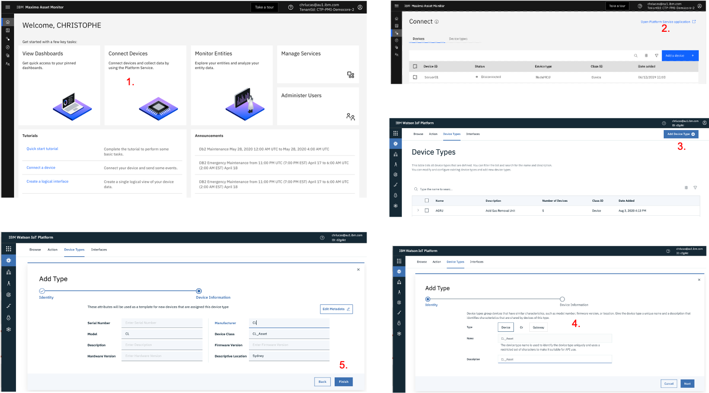&nbsp; 

Now, let's create 3 *Devices* of type *CL_Asset*.

1. Stay in the *Watson IoT Platform*, go to the *Browse* menu and click `Add Device`.
2. On the *identity* page, select your just-created `CL_Asset` as *Entity Type* and enter `CL_Asset_1` in *Device ID*. Click `Next`.
3. On the *Device Information* page, accept the defaults, click `Next`.
4. On the *Security* page, accept the defaults, click `Next`.
5. On the *Summary* page, accept the defaults, click `Finish`.
6. Click `Back`, and repeat above steps 1. to 5. for 2 more Assets: `CL_Asset_2` and `CL_Asset_3`.
7. Finally, go to the `Browse` menu, enter `CL_Asset` in the *Search* field, and you will now see your 3 Devices.

You have now created the required `CL_Asset` *Device Type* and the 3 `CL_Asset_1`, `CL_Asset_2` and `CL_Asset_3` *Devices* that we will use throughout the labs.

 &nbsp;  

---
### 2. Create IoT Simulation
Let's now send data to those 3 Devices !

Using the Watson IoT Platform [IoT Simulation](https://www.ibm.com/support/knowledgecenter/en/SSQP8H/iot/platform/reference/dashboard/device_sim.html) capabilities,
it is possible to simulate a device and its IoT readings - exactly as if it was a real IoT device really connected to the platform and sending real IoT readings.
We are going to use this great functionality as it allows one to literally simulate any asset (e.g. *Pump, Engine, Truck, Conveyor Belt* - you name it !), any IoT readings and do any demo.
For this Lab, we will simulate our 3 `CL_Asset_1_2_3` Devices generating the following IoT readings: `temperature`, `vibration`, `pressure`, `speed`, `acceleration`, `load`, `torque`, `starts` . You can of course change the IoT reading names and/or their values to fit your demo needs.

1. First of all, make sure that in your *Watson IoT Platform*, *Settings* menu, the `Activate Device Simulator` is ON. Once that is done, you will see a little box in bottom-right of your screen showing *0 Simulation*.
2. Click on that `0 Simulation` bottom-right box, and click `Create Simulation`.
3. In the *Select or create a device type* box, select the `CL_Asset` device type you earlier created. That will open a window as you can see in picture below.
4. In *Event type name*, enter `CLA`. in the *Schedule* field, enter `4 Every Minute`. In the *Payload* field, copy-paste the following .json code. Make sure at this stage that the `Store events in the data lake` box remains unchecked ! Click `Save`.
5. Click `Use Registered Device`, enter `CL_Asset` in the *Pick Device* box, select `CL_Asset_1`. 
Repeat for *CL_Asset_2* and *CL_Asset_3*.
6. You should now start seeing Events flowing in the bottom Events box.

Note that the values in the `random(35,40)` functions can be considered being the 'standard operating conditions' for the given IoT reading. 
Later on in the lab, we will change those value ranges for short periods of time (i.e. change the `temperature` ranges from `random(35,40)` to `random(46,49)`) and show how Monitor's out-of-the-box anomaly functions can automatically spot these 'anomalies' which are deviations from the 'standard operating conditions'.

```
 {
    "temperature": random(35,40),
    "vibration": random(1,5),
    "pressure": random(20,25),
    "speed": random(15,20),
    "acceleration": random(8,10),
    "load": random(90,110),
    "torque": random(12,14),
    "starts": increment(1,1)
 }  
```
The below pictures shows the 6 previous steps.
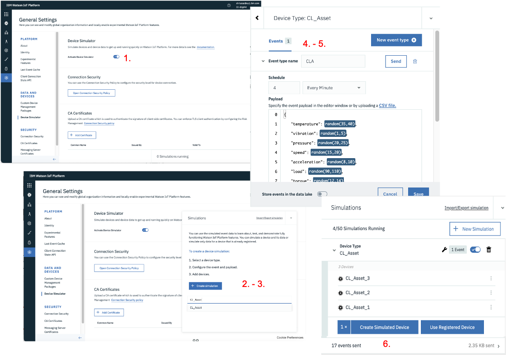 &nbsp; 

Great, you now have your 3 `CL_Asset_1_2_3` Devices generating IoT readings 4 times every minute. 
Let's check those readings on a Dashboard.

---
### 3. Create Watson IoT Platform Dashboard

Let's create a Dashboard so we can see the simulated IoT readings for 1 of our devices: `CL_Asset_1`. 
This Dashboard will allow us to clearly visualise the anomalies earlier mentioned.

1. Still in the *Watson IoT Platform*, click on the *Boards* menu. Click `Create New Board`. Name the Board `CL_Asset IoT Readings Dashobard`. Click `Next` then `Submit`. Open the Board.
2. Let's first create a small card which displays the 8 IoT Readings we simulated, getting updated every 15 seconds. Click `Add New Card`. Select `All device properties` then `CL_Asset_1`, then `Next` then `Submit`.
3. Let's now create a card which shows the flow of data. Click `Add New Card`. Click `Line Chart`, then select `CL_Asset_1`. 
4. Click `Connect data set`. In the *event* field, select `CLA` (that is the name of the IoT Simulation we created earlier),
then in the *Property* select `temperature`. Repeat this for a couple more properties, e.g. `vibration` and `pressure`. Click `Next`, select the `XL` size, click `Next` then `Submit`.
5. Drag and drop the second card next to the first one. Play with the `5 minutes` to `24 hours` views.

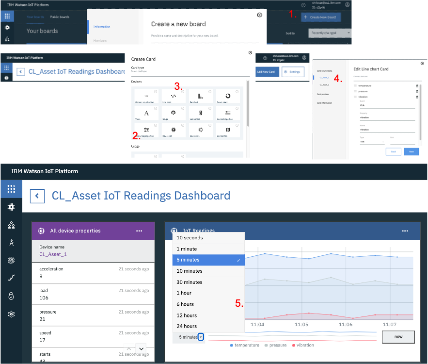 &nbsp;

---
### 4. Create Physical & Logical Interfaces

So far, we have only generated simulated IoT data. 
What Monitor uses for all its visualisations and calculations is the data from the [data lake](https://www.ibm.com/support/knowledgecenter/SSQR84_monitor/iot/overview/architecture_mon.html).
Monitor's data lake is being populated through the use of [Physical & Logical](https://www.ibm.com/support/knowledgecenter/en/SSQP8H/iot/platform/GA_information_management/ga_im_device_twin.html) interfaces.
Let's create those interfaces and populate that data lake !

First let's create the *Physical Interface*.

1. Still in the *Watson IoT Platform*, go to the *Device Types* menu, search then select *CL_Asset*, then click on the *Interface* menu.
2. Click `Create Physical Interface`. Leave the default name *CL_Asset_PI*, click `Next`.
3. Click `Create event type`. Wait 15 seconds or click `Use Last Event Cache` and you will see the *CLA* (which corresponds to the IoT Simulation we earlier created) event appear. 
4. Click that event, click `Add`. Cick `Done`.


 &nbsp;

Let's now create the *Logical Interface*.

1. Click `Create Logical Interface`. Leave the default name *CL_Asset_LI*, click `Next`.
2. Click `Add Property`, `Select` the `temperature`, click `Save`. Repeat this for the 7 other IoT readings.
3. Make sure you tick the `Allow Additional Properties` ON, as that would allow you to add more readings in the future if you wish.
4. Click `Next`, click `no event notifications` and change it to `All events`.
5. Click `Apply`, then `Done`.
6. Click `Activate` twice.

 &nbsp;

---
### 5. Take a break and let some magic happen ...

Brilliant ! You have created all that is needed to start monitoring your own IoT data.
In the next module, we will check that your data lake is now populated.
But first take a break (count 15 minutes at least, but I recommend several hours as all the following reports will show more data), because:

* some background job needs to run to populate your data lake with your IoT data, via the logical interface you just created.
* it is good for the IoT Simulation to keep running a bit, so the visualisations that we will build in next module will show data for more than just 1 hour.
Also, for Anomaly functions to detect anomalies, 'normal conditions' must first occur

---
## 2. Monitor IoT data

### 1. Check your IoT data made it to the Monitor data lake

1. Back to the Monitor interface, click `Monitor Entities`. If you see 3 in `Number of Entities`, it means that your data did make it to the data lake. Let's have a look around.
2. Click on `CL_Asset`. Then click on `CL_Asset_1`, then on its `Metrics` tab. Play with the 'slider' on e.g. `acceleration` - you can see your data now.
3. Go back to the `CL_Asset` main page, and click the `Data` tab. 
See all your (raw) IoT *Metrics* & *Dimensions*. Note that at this stage it is normal to see only a couple points on the graph as we have only been generating data for so long ! Play with the top 'slider' here too.

 &nbsp;

---
### 2. Create an Hourly Summary Dashboard

1. Back to the `CL_Asset` main page, click `New Summary`.
2. Enter `Hourly` as your *Dashboard title*, select `Hourly` *Time grain*, click all *Dimensions*. Click `Next`.
3. Click all `Data Item`, and for just 1 reading e.g. `temperature`, select all `Methods` i.e. `max`, `min`, `mean`, `std` etc. Click `Configure Dashboard`.
4. Click `Configure Dashboard`. The next page shows an overview of what the 
Dashboard will look like. Click `Create`. Note that it will take a couple minutes for your Hourly dashboard to be ready, and you will note a *Preparing* icon during that time.
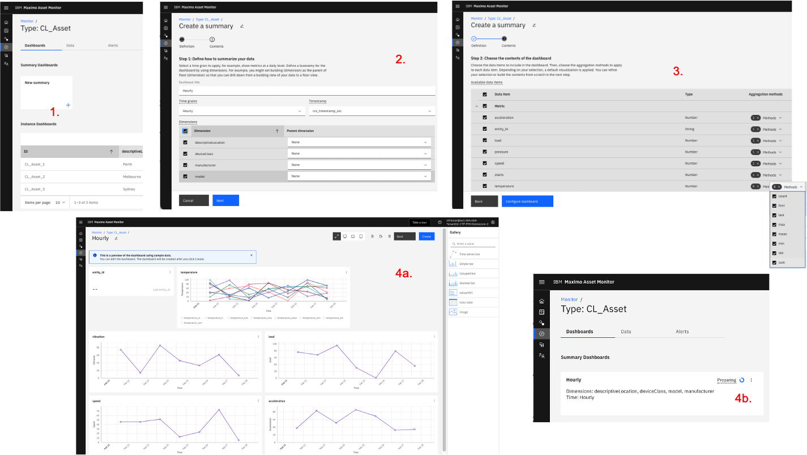 &nbsp;

Once it is ready, your dashboard should look like this 
(with possibly less data points depending on how fast you have been to get here and for how long data has been sent).
Notice the hourly grain of the cards (vs. the shorter time grain that you just saw on the *CL_Asset_1* Metrics tab).
On the left side in `Summary Controls`, notice the so-called Dimensions that correspond to the Metadata we associated to the `CL_Asset` Device Type and 3 Devices when we created them in the Watson IoT Platform.
Notice how you can change the 'time scope' of each card.
Also notice how you can view each card in 'full screen' mode, and further focus on a time period with the top slider-bar.
Finally, also notice how the `temperature` card displays the `max`, `min`, `mean` etc that we defined via the `Methods` and how you can click on 1 or several of these.
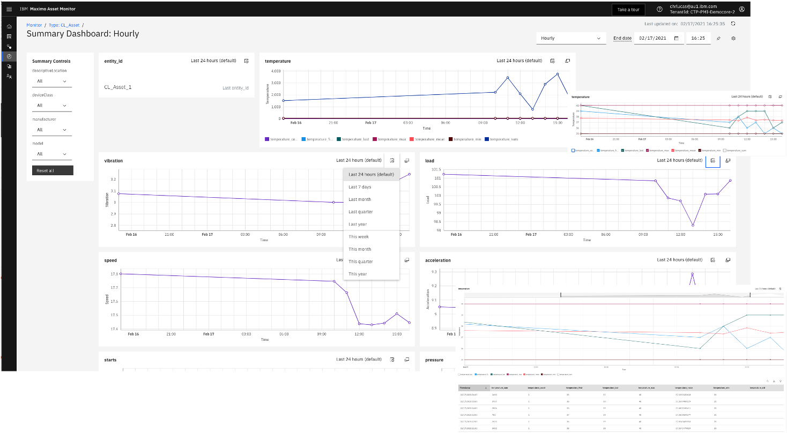 &nbsp;

---
### 3. Explore the Data

1. Back to the `CL_Asset` main page, click on the `Data` tab. Observe that new Data Items have appeared, i.e. under the `Metric (Calculated)` section. 
Notice that for all the IoT Readings, a new `reading_Hourly_mean` *calculated metric* was created - this was automatically done when we crated the hourly dashboard in previous step.
2. In the filer just below *Data Item*, start writing *temp*. This filters the data items displayed. 
Note that for the temperature reading, on top of the mean data item, `temperature_Hourly_min`, `temperature_Hourly_max`, `temperature_Hourly_std` etc were also created - that is because of the 8 *Methods* that we earlier selected for that data item when creating the dashboard.
 &nbsp;


### 4. Create new Data Items
On top of those automatically generated *calculated metric*, it is of course possible to create a vast range of new *calculated metric*.
In the following exercise, we will:
 
*  (a - step 1 to 3) create an hourly *count* of the number of *starts* using the `Count` function, 
*  (b - step 4) use a simple `PythonExpression` function to create temperature readings in Fahrenheit vs. Celsius,
*  (c - step 5 to 6) use the `Entity Filter` and `Filter` functions to retrieve data for only 1 of our Devices (vs. for all Devices of the *CL_Asset* Device Type).

Let's go:

1. On the `Data` tab, click the `+` icon, select the `Count` function, click `Next`. 
2. On the first screen, select `starts` as the data source, enter `1` (default value) in *min_output*. 
Click `Next`. Select `Hourly` in the *Granularity*, untick the `Auto Schedule` and enter `5` in *Executing query* and `2` in *Calculating last* fields.
In the *Output metric* field, enter `starts_Hourly_count`. Click `Create`.
**NOTE**: as always, naming convention is important. As the amount of your data items will grow, you want to use a consistent naming convention that will e.g. facilitate your data viewing capabilities by making filtering easy and straightforward.
3. You will now see the new data item appear in your *Metrics (calculated)* menu. Wait for 5 minutes for results to appear.
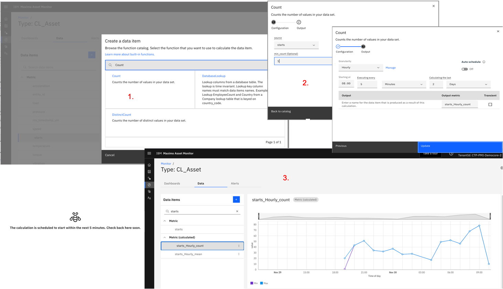 &nbsp;

4. On the `Data` tab, click the `+` icon, select the `PythonExpression` function, click `Next`.
In the *expression* field, type this: `df['temperature'] * 1.8 + 32` - note this is a very simple Python expression using pandas syntax, for more info, see:
[Built-in functions](https://www.ibm.com/support/knowledgecenter/SSQR84_monitor/iot/analytics/reference/references.html) and
[Using Expressions](https://www.ibm.com/support/knowledgecenter/SSQR84_monitor/iot/analytics/as_add_custom_expressions.html?view=embed).
Name the *Output metric* field `temperature_farhenheit`. Set the `Schedule` as we did in step 3., wait 5 minutes. Watch the newly created `temperature_farhenheit` data item.
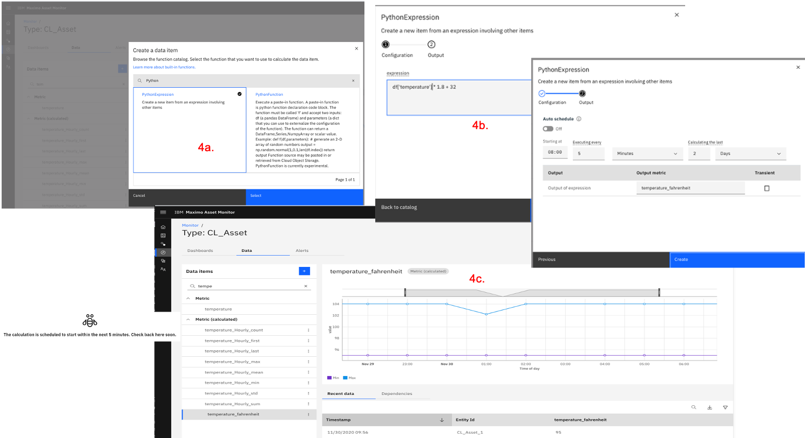 &nbsp;

5. This is a 2-steps process. Firstly, on the `Data` tab, click the `+` icon, select the `EntityFilter` function, click `Next`. In the *entity_list* section, enter `CL_Asset_1`.
Click `Next`, name the *Output metric* field `CL_Asset_1`. Set the `Schedule` as we did in step 3., wait 5 minutes. In `Metrics (calculated)`, search for then watch `CL_Asset_1`. 

6. Secondly, we will use this *filter* and apply it to the *temperature* IoT reading. 
On the `Data` tab, click the `+` icon, select the `Filter` function, click `Next`. In the *sources* section, select the just created `CL_Asset_1` data item. 
In the *expression* field, type `${CL_Asset_1} == True`. In the *filtered_sources* field, select `temperature`. Click `Next`.
Set the `Schedule` as we did in step 3. Name the *Output metric* field `temperature_CL_Asset_1`. Wait 5 minutes.
Watch the newly created *data item* which now displays the *temperature* values for *CL_Asset_1* only !
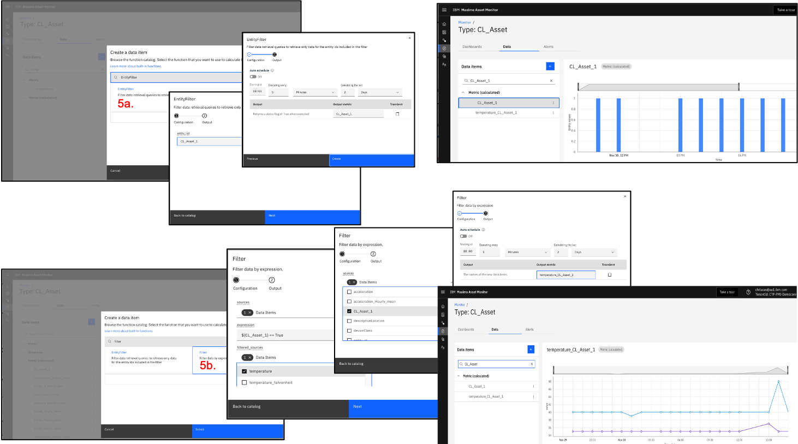 &nbsp;

---
### 5. Create some anomalous IoT Readings
Remember [2. Create IoT Simulation](#2-create-iot-simulation) ? 
In that IoT simulation (which should have been running for some time now), we defined random ranges of values
for each IoT reading, e.g. `"temperature": random(35,40)`. 
In this section, we are going to change that range during a couple minutes to simulate a sudden and temporary surge in `temperature`.
That will enable us to demonstrate in [7. Create Anomaly Detection functions on your IoT data](#7-create-anomaly-detection-functions-on-your-iot-data)
section that Monitor's out-of-the-box Anomaly Detection functions do actually spot that anomalous 'spike in temperature'.

1. Back to the *Watson IoT Platform*, click the IoT Simulation box in bottom-right corner.
Change the values of `"temperature": random(35,40)` line to `"temperature": random(46,48)`, click `Save`.
Take note of the time on your watch. Let the updated simulation run for 3 to 4 minutes.
After 3 to 4 minutes, set the `"temperature": random(46,48)` back to `"temperature": random(35,40)`, click `Save`.
2. the 'anomaly' we just created is visible on the Dashboard (*10 minutes, 1 hour, 6 hours, 12 hours* views), 
i.e. we clearly see a temporary surge in the temperature readings in the top-right of the screen.

**NOTE**: take note of the date and time when you generated those anomalous IoT readings. 
As you can see in below picture, the anomalous readings
for these labs were created on 30 November 2020, around 04:50 PM.
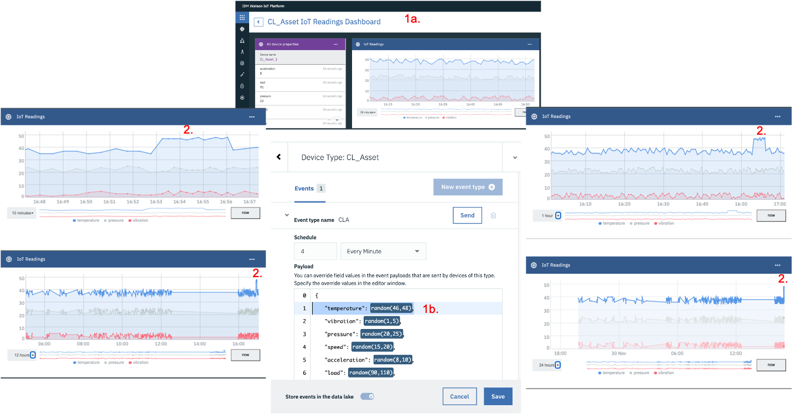 &nbsp;

---
### 6. [OPTIONAL] Understand Monitor's Anomaly Detection capabilities

Although this section is optional, it is highly recommended.
This is a full Lab on itself, and plan 2 to 3 hours to complete it.
You can access it here: [Monitor Anomalies](https://mam-hol.eu-gb.mybluemix.net/monitor-hol/monitor_anomalies/).

In this great deep-dive lab, you will:

* View 3 great short Youtube movies explaining all the ins and outs of Anomaly Detection.
* Create simulated `Robots` that *Monitor* enables you to easily create and that come with all the required data needed to understand and play with Anomaly Detection. 
* Understand the distinction between *Summary* & *Instance* dashboards and create both.
* Understand how to create *Metric Line Cards* and display *Anomaly Detections* on them.
* Create and display *Alerts* and display them ... and so much more !

---
### 7. Create Anomaly Detection functions on your IoT data
In this section, we are going to create 5 Anomaly models and see if they detect 
the *temperature* anomalous IoT readings we generated in [5. Create some anomalous IoT Readings](#5-create-some-anomalous-iot-readings) section.

1. On the `Data` tab, click the `+` icon, enter `Anomaly` in the *Search* box and have a look at all out 
*Monitor*'s available models. Click the `FFTbasedGeneralizedAnomalyScore` one. Click `Next`.
2. Select the `Apply to all entities of the selected type` scope. Click `Next`.
3. Select the `temperature` as *input item* and leave the default *windowsize* to `12`. Click `Next`.
4. Set the Schedule as in previous section, and name the *Output metric* field `temperature_anomaly_fft`.
5. Wait 5 minutes, and now watch the `temperature_anomaly_fft` graph. Do notice how a sudden peak of the anomaly score is observed 
on the 04:00 PM line ... remember 04:50 PM on November 2020 !
This confirms that this FFT model did perfectly pick up the anomalous `temperature` IoT readings we generated.
6. Repeat steps 5 to 6 (keep all the defaults) for the following anomaly detection functions: 
`GeneralizedAnomalyScore`, `KMeansAnomalyScore`, `SaliencybasedGeneralizedAnomalyScore`, `SpectralAnomalyScore`.
Respecting the naming conventions, name your associated data items `temperature_anomaly_generalized`, `temperature_anomaly_kmeans`,
`temperature_anomaly_saliency`, `temperature_anomaly_spectral` respectively. Open the corresponding `Metric (calculated)` *data item*
and notice how all 5 Anomaly functions perfectly spotted the November 2020, 04:50 PM anomalies, i.e. display a sudden peak in their score at that time !
 &nbsp;

**NOTE**: the anomalies we earlier generated are very obvious - on purpose for this demo -, 
i.e. during just a couple minutes (around 04:50 PM), we generated *temperature* readings ranging from 46 to 48,
whereas our IoT Simulation generated readings ranging from 35 to 40 for most of the time.
No surprise then that all the 5 Anomaly models that we created spotted those obvious anomalies.
However, be aware that those *Monitor*'s out-of-the-box anomaly models can detect much more than those obvious anomalies !
You can find more information on those models here: 
[Unsupervised anomaly detectors](https://www.ibm.com/support/knowledgecenter/SSQR84_monitor/iot/analytics/as_anomaly_unsupervised.html)
and [Supervised anomaly detectors](https://www.ibm.com/support/knowledgecenter/SSQR84_monitor/iot/analytics/as_anomaly_supervised.html).
This picture gives a very quick overview of the main types of anomalies that *Monitor* can detect and which models are available.
 &nbsp;

---
### 8. Create Alerts based on Anomaly scores
As you just learned, *Monitor*'s Anomaly Detection functions can easily spot anomalies and be viewed on a graph where the X-axis is *Time*
and the Y-axis is an *Anomaly Score*.
Each function returns a different score *range* (that is inherent to each model essence). 
What we are typically interested in our 'Anomaly Detection' work is to spot peaks in those scores, which correspond to the most likely anomalous readings we want to be alerted of.   
This is where Monitor's *Alerts* come into play.
*Alerts* can be automatically generated in *Monitor* when one (any) of the *Metrics* of Monitor go above or below a certain value.
In this exercise, we will generate *Alerts* based on the `temperature_anomaly_*` metrics we created in the previous section.

The whole idea is that we want to be alerted when a serious anomaly occurs, 
but we do NOT want to be over alerted and drown into a so-called 'alert storm'.
Also, what we want to avoid is generating way too many alerts into the system which would just 'pollute the database' with thousands of irrelevant and meaningless rows !
Because *Anomaly Scores* are something dynamic, it is key that we look at those score values first before creating alerts based on them.

So first of all, let's have a detailed look at your anomaly scores.
Let's focus just on `temperature_anomaly_generalized`, `temperature_anomaly_kmeans` and `temperature_anomaly_fft` in this exercise.
Although your scores might be slightly different, what you should note is that, whereas the (max values of the) anomaly scores remained consistently
low most of the time that our IoT Simulation was running (i.e. `"temperature": random(35,40)`),
we can observe a clear spike for each of those scores corresponding to the November 20, 04:50 PM surge (i.e. `"temperature": random(46,48)`).
The picture and table below give an idea of those scores.
This should give us a good-enough idea of where to start with our alerts ... 

| Anomaly Data Item              		| Normal Condition Score  | Anomalous Condition Score    |
| ------------------------------------- |:----------------:| ----------------------------:|
| `temperature_anomaly_generalized`     |  <<0.200          | >1.5 						  |
| `temperature_anomaly_kmeans`  		|  <<10             | >30 						  |
| `temperature_anomaly_fft`             |  <<100           | >450       				  |

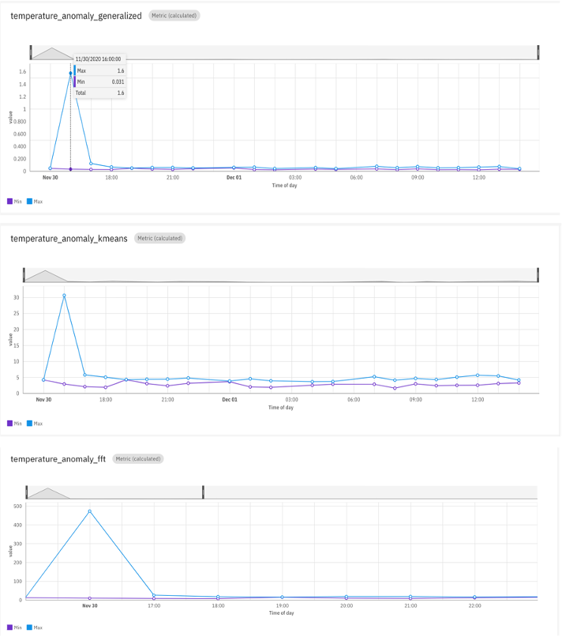 &nbsp;

1. On the `Data` tab, click the `+` icon, select `AlertHighValue`. Select `temperature_anomaly_kmeans` as *input_item*,
enter `30` as the *upper_threshold*, select `Medium` in *Severity* and `New` in *Status*.
Click `Next`, set the `Schedule` and name it `temperature_alert_kmeans`.
2. Repeat above step for `temperature_alert_generalized` (*input_item* = `temperature_anomaly_generalized`, *upper_threshold* = `1.5`, *Severity* = `High`, *Status* = `Validated`),
and `temperature_alert_fft` (*input_item* = `temperature_anomaly_fft`, *upper_threshold* = `450`, *Severity* = `Low`, *Status* = `Acknowledged`).
3. Let's now have a look at the number of *Alerts* we generated. First notice that the newly created Alerts appear as
another data item in the *Alert (calculated)* section. Click on e.g. `temperature_alert_kmeans`. NOTE: it might be that you see
nothing on the graph and on the table under it, e.g. that might be the case if your IoT reading anomalies were generated yesterday. 
That is normal, because the default time range of those graphs is 1 day.
On the table below the graph, click `Last Week` (vs. the default). See that for `temperature_alert_kmeans`, 4 Alerts were generated.
4. Under the column *Entity ID*, click `CL_Asset_1`, this will open a new window. Click `Events`, click `Last Week` (vs. the default),
and you will see that we generated about 10 Alerts for *CL_Asset_1* - that is a reasonable number, we are not going to overflow the system !
 &nbsp;


---
### 9. Update your Summary Dashboard


In this final 'Monitor Lab' section, we are going to bring everything together and show how you can create and customise
dashboards to - literally - visualise whatever you want from all the data we generated so far.

1. Open the *CL_Asset Hourly* dashboard. Top-right, click `Edit Dashboard`. 
That will open the Dashboard visual editor where we can see the default cards that we created in the [2. Create an Hourly Summary Dashboard](#2-create-an-hourly-summary-dashboard) section.
Notice you can drag and drop the cards around on the dashboard.
Notice the types of cards that can be created in the Gallery - Time Series, Bar charts, Images etc.
 &nbsp;

2. Let's delete all the cards, and re-create a Dashboard from scratch. 
On the top right of each card, click `Delete`.
 &nbsp;

3. Let's first create an **Image card** on which we will then display hotspots. 
Download this image [Image](../files/CL_Asset.jpg) and save it as `CL_Asset.jpg` on your computer.
Click `Image` in the Gallery and drag-drop the `CL_Asset.jpg` on the card. Then click `Add from gallery` and select the image.
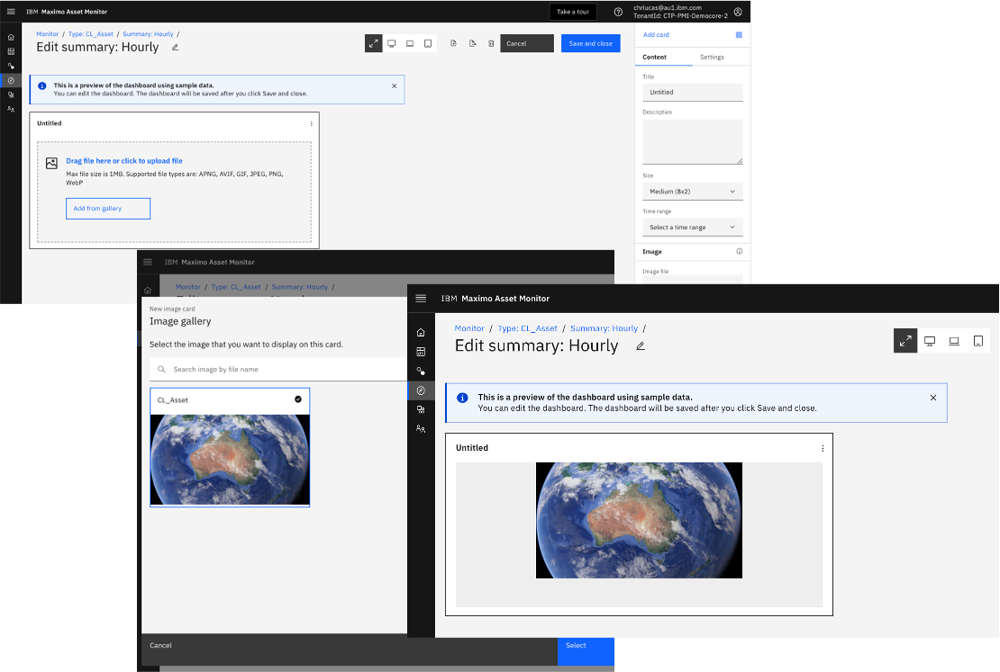 &nbsp;

4. Make the card `Size` *Medium (8x2)*, select *Last 24 hours* in `Time Range`. In `Settings`, click *Fill* in `Image display options`.
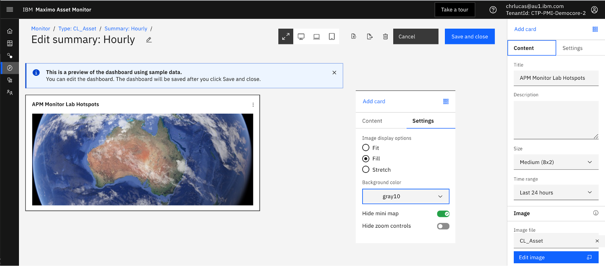 &nbsp;

5. In the Gallery, click `Edit Image`. On the `Hotspots` tab, click *Temperature* and *Vibration* 
in `X coordinate` and `Y coordinate` boxes. Then click the blue spot that appeared on the map. 
On the `Tooltip` tab, enter *This is a hotspot* and select the *Temperature* icon and color. 
On the `Data Source` tab, select e.g. the data items as per picture below.
Click `Save`.
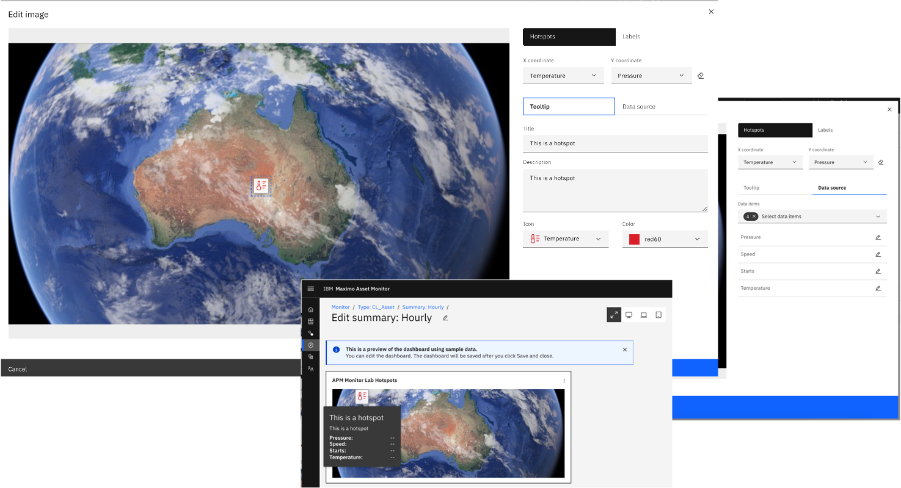 &nbsp;

6. We'll now create a **Value/KPI Card**. Click `Value/KPI Card` in the Gallery.
Enter *Temperature Values* in the `Title`. Click `Medium thin (4x2)` as Size and select `temperature_Hourly_max`,
`temperature_Hourly_mean` and `temperature_Hourly_min` in the Data Section.
For those 3 data items, click edit, enter 2 in *Decimal Places*, Celsius in *Unit* and add thresholds as per picture below. Click `Save`.

7. Click `Value/KPI Card` in the Gallery. 
Create a card called `Max Pressure` card, with *pressure* and size `Small (4x1)`, and define a simple Threshold as in step 6.

8. Repeat 7. for `Starts Count`. Click `Save and Close` and view the Dashboard.
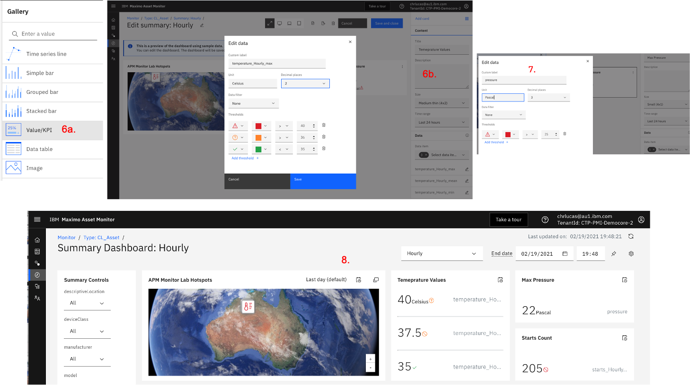 &nbsp;

9. Create 2 new **Time series line** cards as per picture below.
 &nbsp;

10. Create a **Grouped bar** (called *Pressure, Torque, Temp Mean by City*) 
and a **Stacked Bar** (called *Temperature, Pressure, Speed by City*) as per pictures below.
NOTE: due to a little issue (solved in next release), make sure you add a `"aggregator": "mean"` 
line after each attribute via the *Open JSON editor*.
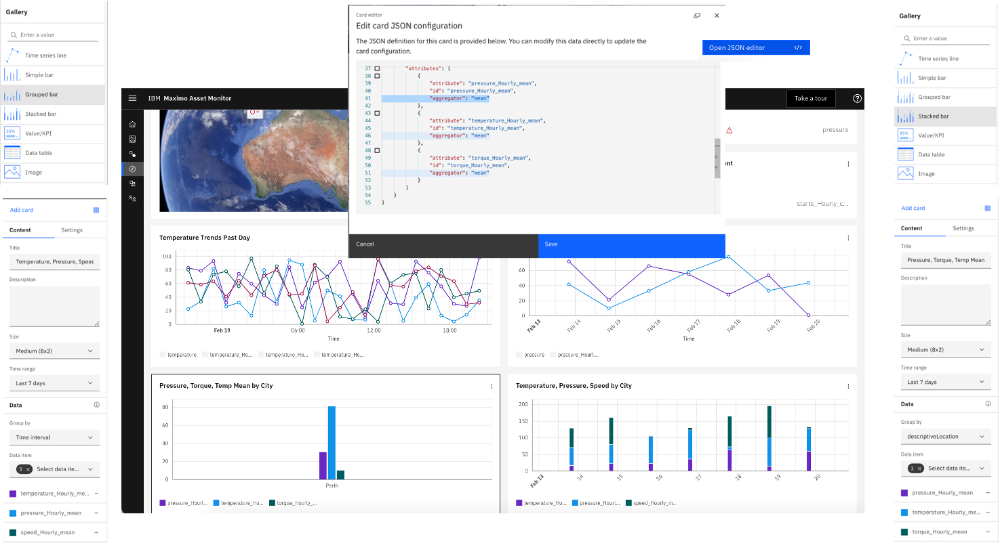 &nbsp;

11. Finally, let's create a **Data table** card that displays Alerts, 
and a **Time series line** that displays the *Max Temperature* readings and all their Anomalies trends.
Your final dashboard should look like this:
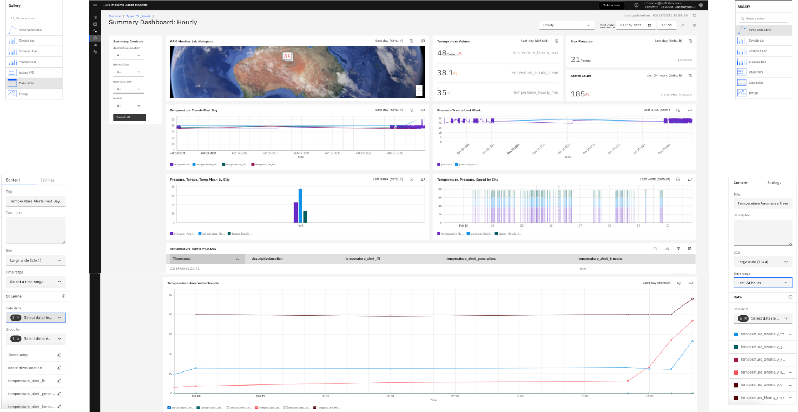 &nbsp;

Congratulations, you made it - hope you enjoyed this lab !


 